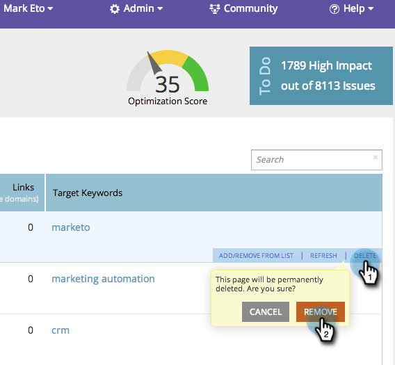

# SEO - Remover/excluir uma página {#seo-remove-delete-a-page}

Deseja excluir uma página? Sem suor, eis como:

1. Vá para a seção **Páginas**.

   

1. Na guia Páginas, passe o mouse sobre a página que deseja remover, clique em **DELETE** e, em seguida, clique em **REMOVER**.

   

1. Pedaço de bolo. Esta página agora é removida permanentemente da sua lista.

