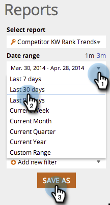

# SEO - Uso do Relatório de Tendências do KW Concorrente {#seo-use-the-competitor-kw-trends-report}

Neste relatório, você pode ver como você e seus concorrentes são classificados em palavras-chave ao longo do tempo.

## Localizar Relatórios {#find-reports}

1. Ir para **[!UICONTROL Relatórios]**.

   

1. Clique em **[!UICONTROL Tendências de Classificação do KW Concorrente]**.

   

## Gráfico de tendências de classificação do KW {#kw-rank-trends-graph}

Este gráfico pode mostrar a porcentagem de suas palavras-chave classificadas em um intervalo especificado e como seus concorrentes se acumulam.

| Item | Descrição |
|---|---|
| [!UICONTROL Palavras-chave] | O número de palavras-chave que você está rastreando. |
| [!UICONTROL URLs de classificação] | O número de URLs na classificação do site no intervalo definido. |
| [!UICONTROL % na classificação] | A porcentagem de classificação de palavras-chave no intervalo definido. |
| [!UICONTROL Média pesquisas] | O número médio de pesquisas nessas palavras-chave que ocorreram durante o intervalo definido (nos últimos 30 dias, na pesquisa do Google nos EUA) |

## Filtrar dados {#filtering-data}

1. Clique na lista suspensa e selecione o período desejado.

   

1. Clique na lista suspensa **[!UICONTROL Classificação]** para escolher para qual intervalo de classificação você deseja exibir palavras-chave.

   

## Exportando dados {#exporting-data}

1. Clique em **[!UICONTROL Exportar CSV]** ou **[!UICONTROL Export PDF]**.

   
