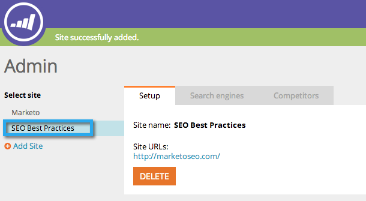

# SEO - Adicionar um site/excluir um site {#seo-add-a-site-delete-a-site}

Para que o Marketo extraia dados (links de entrada e recomendações) relevantes para as páginas do site, você deve definir o URL do site aqui.

>[!IMPORTANT]
>
>Em 31 de março de 2026, o Marketo Engage descontinuará o recurso de Otimização do mecanismo de pesquisa. Exporte todos os dados relevantes até 30 de março. [Saiba mais](https://nation.marketo.com/t5/product-blogs/marketo-engage-seo-feature-deprecation/ba-p/359060){target="_blank"}.
>
>* [Exportar problemas](https://experienceleague.adobe.com/pt-br/docs/marketo/using/product-docs/additional-apps/seo/pages/seo-export-issues-to-csv){target="_blank"}
>* [Exportar Resultados de Palavra-chave](https://experienceleague.adobe.com/pt-br/docs/marketo/using/product-docs/additional-apps/seo/keywords/seo-exporting-keyword-results){target="_blank"}
>* [Exportar Tendências de Palavra-chave](https://experienceleague.adobe.com/pt-br/docs/marketo/using/product-docs/additional-apps/seo/reports/seo-use-the-keyword-trends-report#exporting-data){target="_blank"}
>* [Exportar Tendências de Palavra-chave do Concorrente](https://experienceleague.adobe.com/pt-br/docs/marketo/using/product-docs/additional-apps/seo/reports/seo-use-the-competitor-kw-trends-report#exporting-data){target="_blank"}

## [!UICONTROL Adicionar um site] {#add-a-site}

1. Clique na lista suspensa Administrador e selecione **[!UICONTROL Administrador]**.

   >[!NOTE]
   >
   >**Permissões de administrador necessárias**

   

1. Clique em **[!UICONTROL Adicionar Site]**.

   

1. Insira o **[!UICONTROL Nome], [!UICONTROL URL do site]** e clique em **[!UICONTROL Salvar]**.

   >[!TIP]
   >
   >Você também pode adicionar uma **[!UICONTROL URL do blog]**, se você tiver uma.

   

   Ótimo! Você acabou de adicionar outro site.

   

## Excluir um site {#delete-a-site}

Se você estiver rastreando mais de um site, também poderá excluir um site que não esteja mais interessado em otimizar.

1. Clique na lista suspensa Administrador e selecione **[!UICONTROL Administrador]**.

   

1. Clique no site que deseja remover.

   

1. Clique em **[!UICONTROL Excluir]**.

   

1. Confirme se deseja **[!UICONTROL Excluir]**.

   

   >[!NOTE]
   >
   >Você só pode excluir um site se tiver mais de um. Se você tiver apenas um, poderá executar uma redefinição selecionando o site e clicando em **[!UICONTROL Redefinir]**. Redefinir um site _excluirá todos os dados do site_ e recriará o site.
