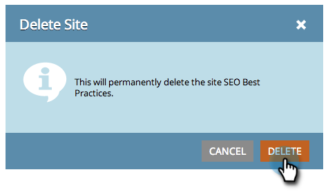

# SEO - Adicionar um site/Excluir um site {#seo-add-a-site-delete-a-site}

Para que o Marketo obtenha dados (links de entrada e recomendações) relevantes para as páginas do site, você deve definir o URL do site aqui.

>[!NOTE]
>
>**Disponibilidade**
>
>Nem todos os clientes adquiriram essa funcionalidade. Entre em contato com seu representante de vendas para obter detalhes.

## Adicionar um site {#add-a-site}

1. Clique na lista suspensa Admin e selecione **Admin**.

   >[!NOTE]
   >
   >**Permissões de administrador necessárias**

   

1. Clique em **Adicionar site**.

   

1. Digite o **Nome, o URL** do site e clique em **Salvar**.

   >[!TIP]
   >
   >Você também pode adicionar um URL **** **** Blog se tiver um.

   

   Ótimo! Você acabou de adicionar outro site.

   

## Excluir um site {#delete-a-site}

Se você estiver rastreando mais de um site, também poderá excluir um site que não esteja mais interessado em otimizar.

1. Clique na lista suspensa Admin e selecione **Admin**.

   

1. Clique no site que deseja remover.

   

1. Clique em **Excluir**.

   
Confirme que deseja excluir.
   

   >[!NOTE]
   >
   >Você só pode excluir um site se tiver mais de um. Se você tiver apenas um, poderá executar uma redefinição selecionando o site e clicando em **Redefinir**. Redefinir um site irá *eliminar todos os dados* do site e recriá-lo.

