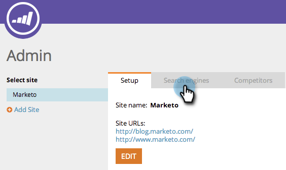
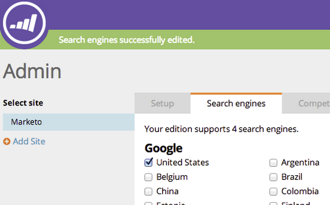

# SEO - Escolha a região/país para seu mecanismo de pesquisa {#seo-pick-region-country-for-your-search-engine}

Os administradores de SEO poderão escolher a região do mecanismo de pesquisa na qual você gostaria de obter informações sobre a classificação de palavras-chave.

>[!NOTE]
>
>**Permissões de administrador necessárias**

1. Vá para a seção **[!UICONTROL Admin]**.

1. Clique na guia **[!UICONTROL Mecanismos de pesquisa]**.

   

1. Escolha o país/cidade que deseja otimizar e clique em **[!UICONTROL Salvar]**.

>[!NOTE]
>
>Por padrão, você pode usar um país para um mecanismo de pesquisa. Se precisar de mais, entre em contato com seu representante de vendas.

Excelente trabalho. Agora você verá as classificações das palavras-chave para o país ou cidade de sua escolha.

>[!MORELIKETHIS]
>
>* [Noções básicas sobre o painel: Instantâneo SEO](/help/marketo/product-docs/additional-apps/seo/understanding-seo/understanding-the-seo-dashboard-seo-snapshot.md){target="_blank"}
>* [Noções básicas sobre o painel: SEO Recommendations](/help/marketo/product-docs/additional-apps/seo/understanding-seo/understanding-the-seo-dashboard-seo-recommendations.md){target="_blank"}
