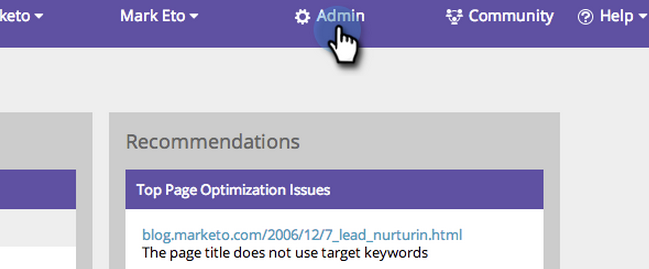
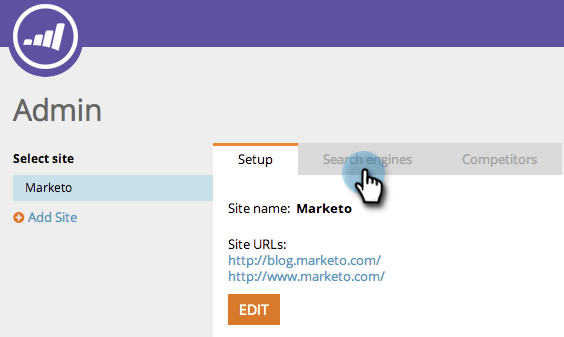

# SEO - Escolher a região/país para seu mecanismo de pesquisa {#seo-pick-region-country-for-your-search-engine}

Os administradores de SEO poderão escolher a região do mecanismo de pesquisa na qual você gostaria de obter informações sobre a classificação de palavras-chave.

>[!IMPORTANT]
>
>Em 31 de março de 2026, o Marketo Engage descontinuará o recurso de Otimização do mecanismo de pesquisa. Exporte todos os dados relevantes até 30 de março. [Saiba mais](https://nation.marketo.com/t5/product-blogs/marketo-engage-seo-feature-deprecation/ba-p/359060){target="_blank"}.
>
>* [Exportar problemas](https://experienceleague.adobe.com/en/docs/marketo/using/product-docs/additional-apps/seo/pages/seo-export-issues-to-csv){target="_blank"}
>* [Exportar Resultados de Palavra-chave](https://experienceleague.adobe.com/en/docs/marketo/using/product-docs/additional-apps/seo/keywords/seo-exporting-keyword-results){target="_blank"}
>* [Exportar Tendências de Palavra-chave](https://experienceleague.adobe.com/en/docs/marketo/using/product-docs/additional-apps/seo/reports/seo-use-the-keyword-trends-report#exporting-data){target="_blank"}
>* [Exportar Tendências de Palavra-chave do Concorrente](https://experienceleague.adobe.com/en/docs/marketo/using/product-docs/additional-apps/seo/reports/seo-use-the-competitor-kw-trends-report#exporting-data){target="_blank"}

>[!NOTE]
>
>**Permissões de administrador são necessárias**

1. Vá para a seção **[!UICONTROL Admin]**.

1. Clique na guia **[!UICONTROL Mecanismos de pesquisa]**.

   

1. Escolha o país/cidade que deseja otimizar e clique em **[!UICONTROL Salvar]**.

>[!NOTE]
>
>Por padrão, você pode usar um país para um mecanismo de pesquisa. Se precisar de mais, entre em contato com seu representante de vendas.

Agora veja a classificação das palavras-chave para o país ou cidade de sua escolha.

>[!MORELIKETHIS]
>
>* [Noções básicas sobre o painel: Instantâneo SEO](/help/marketo/product-docs/additional-apps/seo/understanding-seo/understanding-the-seo-dashboard-seo-snapshot.md){target="_blank"}
>* [Noções básicas sobre o painel: Recomendações de SEO](/help/marketo/product-docs/additional-apps/seo/understanding-seo/understanding-the-seo-dashboard-seo-recommendations.md){target="_blank"}
