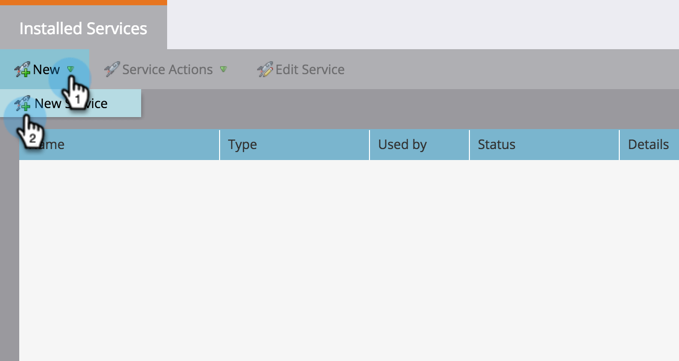

# Adicionar Google AdWords como um Serviço LaunchPoint {#add-google-adwords-as-a-launchpoint-service}

Vincule sua conta do Google AdWords ao Marketo para fazer upload automático de dados de conversão offline do Marketo para o Google AdWords. Em seguida, na interface do usuário do AdWords, você poderá ver com facilidade quais cliques resultaram em clientes qualificados de vendas, oportunidades e novos clientes (ou quaisquer estágios de receita que deseja rastrear) depois de adicionar [colunas personalizadas](https://support.google.com/adwords/answer/3073556) no AdWords. Essas informações não aparecem na interface do usuário do Marketo.

Saiba mais sobre o [recurso de importação de conversão offline do Google](https://support.google.com/adwords/answer/2998031?hl=en).

>[!NOTE]
>
>**Permissões de administrador necessárias**

>[!NOTE]
>
>Você também pode integrar um [Google AdWords como um serviço do Launchpoint com uma conta de gerente](/help/marketo/product-docs/administration/additional-integrations/add-google-adwords-as-a-launchpoint-service-with-a-manager-account.md).

1. Vá para a seção **Admin**.

   

1. Selecione **LaunchPoint**.

   

1. Selecione **Novo** e **Novo Serviço**.

   

1. Digite um nome para exibição e selecione **Google AdWords**.

   

1. Selecione **Autorizar marketing**.

   >[!NOTE]
   >
   >Certifique-se de fazer logout de sua conta pessoal do Gmail e ativar pop-ups.

   

1. Selecione sua conta associada ao Google AdWords.

   

1. Selecione **Aceitar**.

   

1. O status será exibido como **Success**. Selecione **Próximo**.

   

1. Carregue suas conversões offline de Marketo para Google AdWords **Weekly** ou **Diariamente**.

   

1. Conversão de atributo para **Primeiro clique** ou **Último clique**.

   | Tipo | Definição |
   |---|---|
   | Primeiro clique | As conversões offline serão atribuídas ao primeiro AdWords e que uma pessoa clicou nos últimos 90 dias |
   | Último clique | As conversões offline serão atribuídas ao último AdWords e que uma pessoa clicou |

   >[!NOTE]
   >
   >O uso de um modelo de atribuição consistente no Marketing e no AdWords fornece os dados mais precisos.

   

1. Clique em **Criar**.

   

   >[!NOTE]
   >
   >[A ](https://support.google.com/adwords/answer/1752125?hl=en) marcação automática deve ser selecionada para que esse recurso funcione. A desativação deve ser feita dentro do AdWords.

Ótimo! Consulte o artigo relacionado abaixo para saber como mapear as conversões offline do AdWords no modelo de receita.

>[!MORELIKETHIS]
>
>[Definir conversões do Google AdWords no modelo de receita](/help/marketo/product-docs/reporting/revenue-cycle-analytics/revenue-cycle-models/set-google-adwords-conversions-in-the-revenue-model.md)
