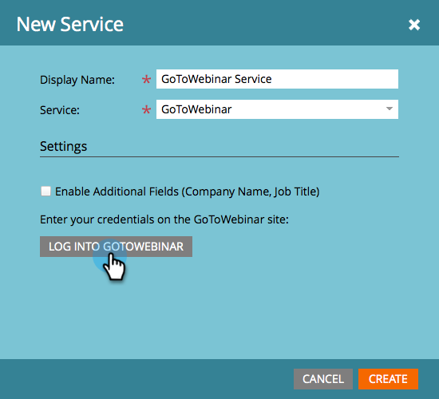

# Adicionar GoToWebinar como um Serviço LaunchPoint {#add-gotowebinar-as-a-launchpoint-service}

O Marketo gerencia sua inscrição e participação no GoToWebinar.

>[!NOTE]
>
>**Permissões de administrador necessárias**

>[!NOTE]
>
>**Lembrete**
>
>Uma subscrição existente para GoToWebinar e direitos de administração são necessários para esta etapa. Tenha o email e a senha que você usa para fazer logon no GoToWebinar à mão.

>[!NOTE]
>
>No momento, não há suporte para GoToMeeting, GoToWebcast e GoToTraining.

1. Vá para **Admin** e selecione **LaunchPoint**.

   

1. Selecione **Novo** e **Novo serviço**.

   

1. `Enter a **Display Name**. Under **Service**, select`**GoToWebinar**.

   

1. Em seguida, clique em **Fazer logon** no **GoToWebinar**.

   

   >[!NOTE]
   >
   >Se você quiser sincronizar Nome da Empresa e Título do trabalho do formulário Marketo com GoToWebinar, selecione a caixa **Ativar campos** adicionais.

1. Na janela pop-up IrParaWebinar Entrar, digite seu email e senha **IrParaWebinar** e clique em **Entrar**.

   

1. Depois que a janela for fechada, clique em **Criar**.

   

1. Ótimo! Sua conta **GoToWebinar** agora é sincronizada com Marketo.

   

>[!CAUTION]
>
>Ao atualizar sua senha no GoToWebinar, você também deve atualizar sua senha no Marketo.

>[!MORELIKETHIS]
>
>Saiba como [criar um evento com o GotoWebinar](../../../product-docs/demand-generation/events/create-an-event/create-an-event-with-gotowebinar.md).

