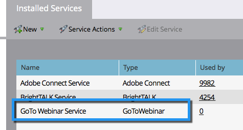

# Adicionar [!DNL GoToWebinar] como um Serviço [!DNL LaunchPoint] {#add-gotowebinar-as-a-launchpoint-service}

O Marketo gerencia sua inscrição e presença no [!DNL GoToWebinar].

>[!NOTE]
>
>**Permissões de administrador são necessárias**

>[!NOTE]
>
>Uma assinatura existente para [!DNL GoToWebinar] e direitos administrativos são necessários para esta etapa. Tenha à mão o email e a senha que você usa para entrar no [!DNL GoToWebinar].

>[!NOTE]
>
>[!DNL GoToMeeting], [!DNL GoToWebcast] e [!DNL GoToTraining] não são suportados no momento.

1. Vá para a área **[!UICONTROL Administrador]**.

   

1. Clique em **[!UICONTROL LaunchPoint]**.

   

1. Selecione **[!UICONTROL Novo]** e **[!UICONTROL Novo serviço]**.

   

1. Insira um **[!UICONTROL Nome para Exibição]**. Em **[!UICONTROL Serviço]**, selecione **[!UICONTROL IrParaWebinário]**.

   

1. Clique em **[!UICONTROL Logon no GoToWebinar]**.

   

   >[!NOTE]
   >
   >Para sincronizar o Nome da Empresa e o Cargo do seu formulário do Marketo com o [!DNL GoToWebinar], marque a caixa **[!UICONTROL Habilitar Campos Adicionais]**.

1. Na janela pop-up de Entrada do [!DNL GoToWebinar], digite seu email e senha do **[!UICONTROL GoToWebinar]** e clique em **[!UICONTROL Entrar]**.

   

1. Após fechar a janela, clique em **[!UICONTROL Criar]**.

   

1. Ótimo! Sua conta **[!UICONTROL GoToWebinar]** agora está sincronizada com o Marketo.

   

>[!CAUTION]
>
>Ao atualizar sua senha no [!DNL GoToWebinar], você também deve atualizá-la no Marketo.

>[!MORELIKETHIS]
>
>Saiba como [criar um evento com [!DNL GotoWebinar]](/help/marketo/product-docs/demand-generation/events/create-an-event/create-an-event-with-gotowebinar.md){target="_blank"}.
