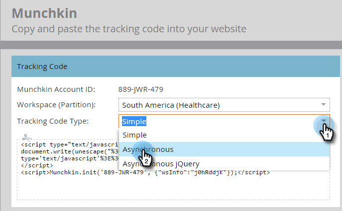

# Adicionar código de rastreamento Munchkin ao seu site {#add-munchkin-tracking-code-to-your-website}

O código de rastreamento personalizado JavaScript do Marketo, chamado Munchkin, rastreia todos os indivíduos que visitam seu site para que você possa reagir às visitas com campanhas de marketing automatizadas. Até visitantes anônimos são rastreados juntamente com seus endereços IP e outras informações. ** Sem este código de rastreamento, você não poderá rastrear visitas ou outras atividades em seu site!**

>[!NOTE]
>
>**Pré-requisitos**
>
>Verifique se você tem acesso a um desenvolvedor JavaScript experiente. O suporte técnico Marketo não está configurado para auxiliar na solução de problemas do JavaScript personalizado.

## Adicionar código de rastreamento ao seu site {#add-tracking-code-to-your-website}

>[!NOTE]
>
>Os clientes da Adobe Experience Cloud também podem usar a integração do Marketo no Adobe Launch para incluir o script Munchkin em suas páginas da Web. Obtenha o aplicativo [aqui](https://www.adobeexchange.com/experiencecloud.details.101054.html).

1. Vá para **Admin** e clique em **Munchkin** na árvore à esquerda.

   

   Selecione Assíncrono para Tipo de código de rastreamento.

   

   >[!NOTE]
   >
   >Em quase todos os casos, você deve usar o código assíncrono. [Saiba mais.](#types-of-munchkin-tracking-codes)

   Clique e copie o código de rastreamento do Javascript para colocar em seu site.

   

   >[!CAUTION]
   >
   >Não use o código mostrado nesta captura de tela. Você deve usar o código exclusivo que aparece em sua conta!

   >[!TIP]
   >
   >Coloque o código de rastreamento nas páginas da Web que deseja rastrear. Esta pode ser cada página para sites menores, ou apenas páginas chave em sites que têm muitas páginas da Web geradas dinamicamente, fóruns de usuários, etc.

   Para obter melhores resultados, use o código Munchkin assíncrono e coloque-o dentro dos `<head>` elementos de suas páginas. Se você estiver usando o código simples (não recomendado), isso ocorrerá antes da `</body>` tag .
   

>[!TIP]
>
>Para sites que visualizam um grande volume de tráfego (isto é, centenas de milhares de visitas por mês), recomendamos que você opte por não rastrear pessoas anônimas. [Saiba mais.](http://developers.marketo.com/documentation/websites/lead-tracking-munchkin-js/)

## Adicionar código de rastreamento ao usar vários espaços de trabalho {#add-tracking-code-when-using-multiple-workspaces}

Se você estiver usando espaços de trabalho em sua conta de marketing, provavelmente também terá presenças da Web separadas que correspondem aos seus espaços de trabalho. Nesse caso, você pode usar o Javascript de rastreamento Munchkin para atribuir suas pessoas anônimas ao espaço de trabalho e partição corretos.

1. Vá para Admin e clique em Munchkin na árvore à esquerda.

1. Selecione a área de trabalho apropriada para as páginas da Web que deseja rastrear.

>[!NOTE]
>
>Se você não usar o código Munchkin do espaço de trabalho especial, as pessoas serão atribuídas à partição padrão que foi criada quando sua conta foi configurada. É chamado de &quot;Padrão&quot; inicialmente, mas você pode ter alterado isso em sua própria conta do Marketing.

1. Selecione Assíncrono para Tipo de código de rastreamento.

   

1. Clique e copie o código de rastreamento JavaScript a ser colocado em seu site.

>[!CAUTION]
>
>Não use o código mostrado nesta captura de tela. Você deve usar o código exclusivo que aparece em sua conta!

1. Coloque o código de rastreamento em suas páginas da Web no `<head>` elemento. As novas pessoas que visitarem esta página serão atribuídas a esta partição.

>[!CAUTION]
>
>Você só pode usar um script de rastreamento Munchkin para uma única partição e espaço de trabalho em uma página. Não inclua scripts de rastreamento para várias partições/espaços de trabalho em seu site.

>[!NOTE]
>
>As landings page criadas no Marketo contêm automaticamente o código de rastreamento, de modo que não é necessário colocar esse código nelas.

## Tipos de códigos de rastreamento Munchkin {#types-of-munchkin-tracking-codes}

Existem três tipos de códigos de rastreamento Munchkin que você pode escolher. Cada impacto no tempo de carregamento da página da Web é diferente.

1. **Simples**: tem menos linhas de código, mas não otimiza o tempo de carregamento da página da Web. Esse código carrega a biblioteca jQuery sempre que uma página da Web é carregada.
1. **Assíncrono**: reduz o tempo de carregamento da página da Web.
1. **jQuery** assíncrono: reduz o tempo de carregamento da página da Web e também melhora o desempenho do sistema. Esse código supõe que você já tenha jQuery e não verifica para carregá-lo.

## Teste se o código Munchkin está funcionando {#test-if-your-munchkin-code-is-working}

Para verificar se o código Munchkin está funcionando depois de adicioná-lo:

1. Visite sua página da Web.
1. Vá para **Analytics**.

   

1. Clique em Atividade **da página** da Web.

   

1. Clique na guia **Configuração** , clique em Fonte **de** Atividade e altere-a para Visitantes **Anônimos (incluindo ISPs)**.

   

   

1. Clique na guia **Relatório** . Se não vir nenhum dado, aguarde alguns minutos e clique no ícone de atualização na parte inferior.

