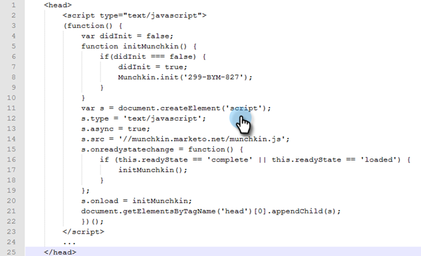
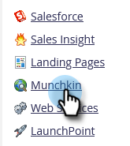
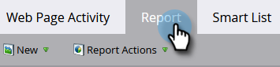

# Adicionar o código de rastreamento [!DNL Munchkin] ao seu site {#add-munchkin-tracking-code-to-your-website}

O código personalizado de rastreamento do JavaScript da Marketo, chamado [!DNL Munchkin], rastreia todas as pessoas que visitam seu site para que você possa reagir às suas visitas com campanhas de marketing automatizadas. Até mesmo visitantes anônimos são rastreados junto com seus endereços IP e outras informações. **Sem este código de rastreamento, você não poderá rastrear visitas ou outras atividades no seu site**!

>[!PREREQUISITES]
>
>Certifique-se de ter acesso a um desenvolvedor experiente do JavaScript. O Suporte Técnico da Marketo não está configurado para ajudar na solução de problemas do JavaScript personalizado.

## Adicionar código de rastreamento ao seu site {#add-tracking-code-to-your-website}

>[!NOTE]
>
>Os usuários do Adobe Experience Cloud também podem usar a [integração do Marketo no Adobe Launch](https://exchange.adobe.com/apps/ec/100223/adobe-launch-core-extension){target="_blank"} para incluir o script [!DNL Munchkin] em suas páginas da Web. Se você usa o Adobe Launch, _o script [!DNL Munchkin] é adicionado automaticamente_, portanto, você mesmo não precisará adicioná-lo.

1. Vá para a área **[!UICONTROL Administrador]**.

   

1. Clique em **[!UICONTROL Munchkin]**.

   

1. Selecione **[!UICONTROL Assíncrono]** para **[!UICONTROL Tipo de Código de Rastreamento]**.

   

   >[!NOTE]
   >
   >Em quase todos os casos, você deve usar o código assíncrono. [Saiba mais](#types-of-munchkin-tracking-codes).

1. Clique em e copie o código de rastreamento do Javascript para colocar em seu site.

   

   >[!CAUTION]
   >
   >Não use o código mostrado nesta captura de tela - você deve usar o código exclusivo que aparece em sua conta!

   >[!TIP]
   >
   >Coloque o código de rastreamento nas páginas da Web que deseja rastrear. Pode ser cada página de sites menores ou somente as páginas principais de sites com muitas páginas da Web geradas dinamicamente, fóruns de usuários etc.

   Para obter melhores resultados, use o código [!DNL Munchkin] assíncrono e coloque-o dentro dos elementos `<head>` de suas páginas. Se você estiver usando o código simples (não recomendado), ele será colocado antes da marca `</body>`.

   

   >[!TIP]
   >
   >Para sites que visualizam um alto volume de tráfego (ou seja, centenas de milhares de visitas por mês), recomendamos que você opte por não rastrear pessoas anônimas. [Saiba mais](https://experienceleague.adobe.com/pt-br/docs/marketo-developer/marketo/javascriptapi/leadtracking/lead-tracking){target="_blank"}.

## Adicionar código de rastreamento ao usar vários espaços de trabalho {#add-tracking-code-when-using-multiple-workspaces}

Se estiver usando espaços de trabalho na sua conta do Marketo, provavelmente você também terá presenças da Web separadas que correspondem aos espaços de trabalho. Nesse caso, você pode usar o Javascript de rastreamento [!DNL Munchkin] para atribuir suas pessoas anônimas ao espaço de trabalho e partição corretos.

1. Vá para a área **[!UICONTROL Administrador]**.

   

1. Clique em **[!UICONTROL Munchkin]**.

   

1. Selecione o espaço de trabalho apropriado para as páginas da Web que deseja rastrear.

   

   >[!NOTE]
   >
   >Se você não usar o código [!DNL Munchkin] do espaço de trabalho especial, as pessoas serão atribuídas à partição padrão criada quando sua conta foi configurada. Inicialmente, ele é denominado &quot;[!UICONTROL Padrão]&quot;, mas você pode ter alterado isso em sua própria conta da Marketo.

1. Selecione **[!UICONTROL Assíncrono]** para **[!UICONTROL Tipo de Código de Rastreamento]**.

   

1. Clique em e copie o código de rastreamento do JavaScript para colocar em seu site.

   

   >[!CAUTION]
   >
   >Não use o código mostrado nesta captura de tela - você deve usar o código exclusivo que aparece em sua conta!

1. Coloque o código de rastreamento em suas páginas da Web no elemento `<head>`. As novas pessoas que visitarem esta página serão atribuídas a esta partição.

   

   >[!CAUTION]
   >
   >Você só pode usar um script de rastreamento [!DNL Munchkin] para uma única partição e espaço de trabalho em uma página. Não inclua scripts de rastreamento para várias partições/espaços de trabalho em seu site.

   >[!NOTE]
   >
   >As landing pages criadas no Marketo contêm automaticamente um código de rastreamento, portanto, não é necessário colocar esse código nelas.

## Tipos de Códigos de Acompanhamento de [!DNL Munchkin] {#types-of-munchkin-tracking-codes}

Há três tipos de [!DNL Munchkin] códigos de rastreamento que você pode escolher. Cada uma afeta o tempo de carregamento da página da Web de forma diferente.

1. **[!UICONTROL Simples]**: tem menos linhas de código, mas não otimiza o tempo de carregamento da página da Web. Este código carrega a biblioteca jQuery sempre que uma página da Web é carregada.
1. **[!UICONTROL Assíncrono]**: reduz o tempo de carregamento da página da Web.
1. **[!UICONTROL Asynchronous jQuery]**: reduz o tempo de carregamento da página da Web e melhora o desempenho do sistema. Esse código pressupõe que você já tenha o jQuery e não verifica se deve carregá-lo.

## Teste se o código [!DNL Munchkin] está funcionando {#test-if-your-munchkin-code-is-working}

Para verificar se o código [!DNL Munchkin] está funcionando depois de ter sido adicionado:

1. Visite sua página da Web.

1. No [!DNL My Marketo], clique no bloco **[!UICONTROL Analytics]**.

   

1. Clique em **[!UICONTROL Atividade da página da Web]**.

   

1. Clique na guia **[!UICONTROL Instalação]** e clique duas vezes em **[!UICONTROL Activity Source]**.

   

1. Altere a [!UICONTROL Activity Source] para **[!UICONTROL Visitantes anônimos (incluindo ISPs)]** e clique em **[!UICONTROL Aplicar]**.

   

1. Clique na guia **[!UICONTROL Relatório]**.

   

   >[!NOTE]
   >
   >Se você não visualizar nenhum dado, aguarde alguns minutos e clique no ícone de atualização na parte inferior.
