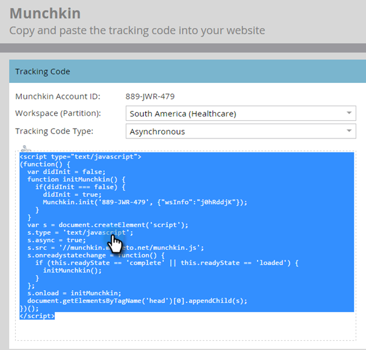

# Adicionar o código de rastreamento do Munchkin ao seu site {#add-munchkin-tracking-code-to-your-website}

O código de rastreamento personalizado JavaScript do Marketo, chamado Munchkin, rastreia todos os indivíduos que visitam seu site para que você possa reagir às visitas com campanhas de marketing automatizadas. Até mesmo visitantes anônimos são rastreados junto com seus endereços IP e outras informações. **Sem esse código de rastreamento, você não poderá rastrear visitas ou outras atividades no seu site**!

>[!PREREQUISITES]
>
>Certifique-se de ter acesso a um desenvolvedor JavaScript experiente. O Suporte técnico da Marketo não está configurado para ajudar na solução de problemas do JavaScript personalizado.

## Adicionar código de rastreamento ao seu site {#add-tracking-code-to-your-website}

>[!NOTE]
>
>Os clientes do Adobe Experience Cloud também podem usar a integração do Marketo no Adobe Launch para incluir o script do Munchkin em suas páginas da Web. Obter o aplicativo [here](https://www.adobeexchange.com/experiencecloud.details.101054.html).

1. Vá para o **Administrador** área.

   

1. Clique em **Munchkin**.

   

1. Selecione Assíncrono para Tipo de código de rastreamento.

   

   >[!NOTE]
   >
   >Em quase todos os casos, você deve usar o código assíncrono. [Saiba mais](#types-of-munchkin-tracking-codes).

1. Clique em e copie o código de rastreamento do Javascript a ser colocado no seu site.

   

   >[!CAUTION]
   >
   >Não use o código mostrado nesta captura de tela - você deve usar o código exclusivo que aparece em sua conta!

   >[!TIP]
   >
   >Coloque o código de rastreamento nas páginas da Web que deseja rastrear. Isso pode ser em todas as páginas para sites menores ou somente páginas-chave em sites que tenham muitas páginas da Web geradas dinamicamente, fóruns de usuários, e assim por diante.

   Para obter melhores resultados, use o código assíncrono do Munchkin e coloque-o dentro do `<head>` elementos de suas páginas. Se você estiver usando o código simples (não recomendado), isso ocorrerá antes da variável `</body>` .

   

   >[!TIP]
   >
   >Para sites que visualizam um alto volume de tráfego (ou seja, centenas de milhares de visitas por mês), recomendamos que você opte por não rastrear pessoas anônimas. [Saiba mais](https://developers.marketo.com/documentation/websites/lead-tracking-munchkin-js/).

## Adicionar código de rastreamento ao usar vários espaços de trabalho {#add-tracking-code-when-using-multiple-workspaces}

Se você estiver usando Espaços de trabalho na sua conta do Marketo, provavelmente também terá presenças da Web separadas que correspondem aos seus espaços de trabalho. Nesse caso, você pode usar o Javascript de rastreamento do Munchkin para atribuir suas pessoas anônimas ao espaço de trabalho e partição corretos.

1. Vá para o **Administrador** área.

   

1. Clique em **Munchkin**.

   

1. Selecione o espaço de trabalho apropriado para as páginas da Web que você deseja rastrear.

   

   >[!NOTE]
   >
   >Se você não usar o código do espaço de trabalho especial Munchkin, as pessoas serão atribuídas à partição padrão que foi criada quando sua conta foi configurada. Ela é chamada de &quot;Padrão&quot; inicialmente, mas você pode ter alterado isso em sua conta do Marketo.

1. Selecionar **Assíncrono** para Tipo de código de rastreamento.

   

1. Clique em e copie o código de rastreamento do JavaScript para colocar em seu site.

   

   >[!CAUTION]
   >
   >Não use o código mostrado nesta captura de tela - você deve usar o código exclusivo que aparece em sua conta!

1. Coloque o código de rastreamento nas páginas da Web no `<head>` elemento. Novas pessoas que visitarem esta página serão atribuídas a esta partição.

   

   >[!CAUTION]
   >
   >Você só pode usar um script de rastreamento Munchkin para uma única partição e espaço de trabalho em uma página. Não inclua scripts de rastreamento para várias partições/espaços de trabalho no site.

   >[!NOTE]
   >
   >As landing pages criadas no Marketo contêm automaticamente o código de rastreamento, portanto, não é necessário colocar esse código nelas.

## Tipos de códigos de rastreamento do Munchkin {#types-of-munchkin-tracking-codes}

Há três tipos de códigos de rastreamento do Munchkin que você pode escolher. Cada um afeta o tempo de carregamento da página da Web de forma diferente.

1. **Simples**: O tem menos linhas de código, mas não otimiza para o tempo de carregamento da página da Web. Este código carrega a biblioteca jQuery cada vez que uma página da Web é carregada.
1. **Assíncrono**: reduz o tempo de carregamento da página da Web.
1. **jQuery assíncrona**: reduz o tempo de carregamento da página da Web e também melhora o desempenho do sistema. Esse código pressupõe que você já tenha um jQuery e não verifica para carregá-lo.

## Teste se o código do Munchkin está funcionando {#test-if-your-munchkin-code-is-working}

Para verificar se o código do Munchkin está funcionando depois de adicioná-lo:

1. Visite sua página da Web.

1. Em Minha Marketo, clique no botão **Analytics** mosaico.

   

1. Clique em **Atividade da página da Web**.

   

1. Clique no botão **Configuração** guia , clique duas vezes **Fonte da atividade**.

   

1. Alterar a origem da atividade para **Visitantes anônimos (incluindo ISPs)** e clique em **Aplicar**.

   

1. Clique no botão **Relatório** guia .

   

   >[!NOTE]
   >
   >Se não vir nenhum dado, espere alguns minutos e clique no ícone de atualização na parte inferior.
