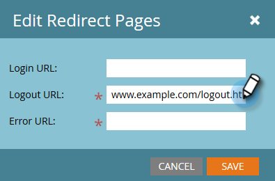

# Adicionar Logon Único a um Portal {#add-single-sign-on-to-a-portal}

Se você tiver um serviço de diretório que autentica usuários, poderá permitir logon único (SSO) na Marketo. Oferecemos suporte a este recurso usando o [!DNL Security Assertion Markup Language] (SAML) versão 2.0 e superior.

O Marketo funciona como um Provedor de serviço (SP) SAML e depende de um Provedor de identidade externo (IdP) para autenticar os usuários.

Quando o SSO está ativado, o IdP pode validar as credenciais de um usuário. Quando um usuário deseja usar o software Marketo, o IdP envia uma mensagem SAML assinada para a Marketo, atuando como o SP. Essa mensagem garante à Marketo que o usuário está autorizado a usar o software da Marketo.

>[!NOTE]
>
>**Permissões de administrador necessárias**

>[!IMPORTANT]
>
>Isso não se aplica a assinaturas integradas ao Adobe Identity. Para assinaturas integradas à Adobe Identity, o Logon único é configurado no nível da Organização da Adobe no Adobe Admin Console. O Adobe Admin Console só oferece suporte a SP iniciados no momento. [Saiba mais aqui](https://helpx.adobe.com/br/enterprise/using/set-up-identity.html){target="_blank"}.

>[!NOTE]
>
>Você é um usuário de [!DNL Microsoft Azure]? Confira o [tutorial de integração](https://learn.microsoft.com/en-us/entra/identity/saas-apps/marketo-tutorial){target="_blank"} deles. Para sua informação, há um erro de digitação na Etapa 5c do tutorial. Defina o Estado de Retransmissão como `https://<munchkinid>.mktoweb.com`, **_não_** `https://<munchkinid>.marketo.com`.

## Como enviar a solicitação {#how-to-send-the-request}

* Enviar a solicitação de SSO, que é uma resposta SAML, para `https://login.marketo.com/saml/assertion/<your-munchkin-id>`
* Como o URL do público-alvo do SP. Usar `http://saml.marketo.com/sp`
* Se você estiver usando o atributo SPNameQualifier, defina o elemento NameID para Subject como `http://saml.marketo.com/sp`
* Se você estiver federando várias assinaturas do Marketo para o mesmo provedor SSO, poderá usar URLs exclusivas do SP para cada subsistema do Marketo com o formato `http://saml.marketo.com/sp/<munchkin_id>`

>[!NOTE]
>
>O Marketo só é compatível com o iniciado pelo Provedor de identidade (também conhecido como iniciado por IdP), no qual o usuário inicia primeiro a página de logon de IdP, autentica e navega até My Marketo. Se sua assinatura do Marketo tiver sido movida para o Admin Console, a Adobe Admin Console oferecerá suporte apenas ao Provedor de serviços iniciado (também conhecido como SP iniciado) no momento. Pode haver alterações feitas na sua experiência com SSO.

## Observações adicionais {#additional-notes}

* **Tempo de sincronização** - Para um novo usuário, há um atraso de aproximadamente 10 minutos antes do processamento de uma solicitação de SSO inicial.
* **Provisionamento de Usuário** - Os usuários são provisionados manualmente pela Marketo.
* **Autorização** - As permissões de usuário são mantidas no Marketo.
* **Suporte a OAuth** - no momento, o Marketo não oferece suporte a OAuth.
* **Propagação Automática de Usuário** - Também conhecida como &quot;Provisionamento Just in Time&quot;, ocorre quando o primeiro logon SAML de um usuário é capaz de criar o usuário em qualquer aplicativo Web que ele esteja acessando (por exemplo, Marketo) e nenhuma ação de administrador manual é necessária. No momento, o Marketo não oferece suporte a isso.
* **Criptografia** - no momento, o Marketo não oferece suporte à criptografia.

>[!NOTE]
>
>Antes de começar, tenha seu Certificado de Provedor de Identidade no formato X.509 e na extensão .crt, .der ou .cer.

## Atualizar Configurações SAML {#update-saml-settings}

O SSO está desativado por padrão. Siga estas etapas para ativar o SAML e configurá-lo.

1. Vá para a área **[!UICONTROL Administrador]**.

   

1. Clique em **[!UICONTROL Logon único]**.

   

   >[!NOTE]
   >
   >Se você não vir o **[!UICONTROL Logon Único]** em **[!UICONTROL Administrador]**, contate o [Suporte da Marketo](https://nation.marketo.com/t5/Support/ct-p/Support){target="_blank"}.

1. Na seção **[!UICONTROL Configurações SAML]**, clique em **[!UICONTROL Editar]**.

   

1. Alterar **[!UICONTROL Logon Único de SAML]** para **[!UICONTROL Habilitado]**.

   

1. Insira sua **[!UICONTROL ID do Emissor]**, **[!UICONTROL ID da Entidade]**, selecione o **[!UICONTROL Local da ID do Usuário]** e clique em **[!UICONTROL Procurar]**.

   

1. Selecione o arquivo **[!UICONTROL Certificado do Provedor de Identidade]**.

   

1. Clique em **[!UICONTROL Salvar]**.

   

## Atualizar configurações da página de redirecionamento {#update-redirect-page-settings}

1. Na seção **[!UICONTROL Redirecionar páginas]**, clique em **[!UICONTROL Editar]**.

   

   >[!NOTE]
   >
   >Os clientes que usam a Universal ID junto com o SSO devem inserir a URL de logon do Provedor de Identidade no campo **[!UICONTROL URL de Logon]**.

1. Insira uma **[!UICONTROL URL de logoff]**. Este é o URL ao qual você deseja que o usuário seja direcionado quando fizer logout do Marketo.

   

1. Insira uma **[!UICONTROL URL de erro]**. Esse é o URL para o qual você deseja que o usuário seja direcionado em caso de falha ao fazer logon no Marketo. Clique em **[!UICONTROL Salvar]**.

   

   >[!NOTE]
   >
   >Ambas as páginas devem estar disponíveis publicamente.

>[!MORELIKETHIS]
>
>* [Usando uma Universal ID para Logon de Assinatura](/help/marketo/product-docs/administration/settings/using-a-universal-id-for-subscription-login.md){target="_blank"}
>* [Restringir o Logon de Usuário apenas ao SSO](/help/marketo/product-docs/administration/additional-integrations/restrict-user-login-to-sso-only.md){target="_blank"}
>* [Convidando Usuários do Marketo para Duas Instâncias com Universal ID](https://nation.marketo.com/t5/Knowledgebase/Inviting-Marketo-Users-to-Two-Instances-with-Universal-ID-UID/ta-p/251122){target="_blank"}
