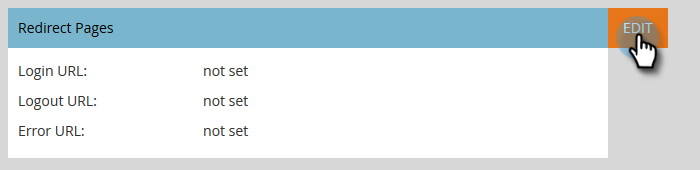

# Adicionar logon único a um portal {#add-single-sign-on-to-a-portal}

Se você tiver um serviço de diretório que autentique usuários, poderá permitir logon único (SSO) no Marketing. Oferecemos suporte a esse recurso usando a SAML (Security Assertion Markup Language) versão 2.0 e superior.

O Marketo funciona como um Provedor de serviço SAML (SP) e depende de um provedor de identidade externo (IdP) para autenticar usuários.

Quando o SSO estiver ativado, o IdP poderá validar as credenciais de um usuário. Quando um usuário deseja usar o software Marketo, o IdP envia uma mensagem SAML assinada ao Marketo, atuando como o SP. Esta mensagem garante ao Marketo que o usuário está autorizado a usar o software Marketing.

>[!NOTE]
>
>**Permissões de administrador necessárias**

>[!NOTE]
>
>Você é um usuário do Microsoft Azure? Confira o [tutorial de integração](https://azure.microsoft.com/en-us/documentation/articles/active-directory-saas-marketo-tutorial/).

## Como enviar a solicitação {#how-to-send-the-request}

* Envie a solicitação SSO, que é uma resposta SAML, para `https://login.marketo.com/saml/assertion/<your-munchkin-id>`
* Como o URL de Audiência da controladora. Usar [http://saml.marketo.com/sp](http://saml.marketo.com/sp)
* Se você estiver usando o atributo SPNameQualifier, defina o elemento NameID para Subject como [http://saml.marketo.com/sp](http://saml.marketo.com/sp)
* Se estiver federando várias subscrições de marketing ao mesmo provedor SSO, você poderá usar URLs SP exclusivos para cada submarino de marketing com o formato `http://saml.marketo.com/sp/<munchkin_id>`

>[!NOTE]
>
>O Marketo só oferece suporte ao provedor de identidade iniciado (também conhecido como iniciado pelo IdP), no qual o usuário inicia a página de logon do Idp pela primeira vez, autentica e navega até Meu Marketo.

## Notas adicionais {#additional-notes}

* **Tempo**  de sincronização - para um novo usuário, há um atraso de cerca de 10 minutos antes de uma solicitação SSO inicial ser processada.
* **Provisionamento**  do usuário - os usuários são provisionados manualmente pelo Marketo.
* **Autorização**  - as permissões do usuário são mantidas em Marketo.
* **Suporte**  a OAuth - no momento, o Marketo não suporta OAuth.

>[!NOTE]
>
>Antes de iniciar, tenha seu Certificado do provedor de identidade no formato X.509 e na extensão .crt, .der ou .cer.

## Atualizar configurações SAML {#update-saml-settings}

O SSO está desativado por padrão. Siga estas etapas para habilitar o SAML e configurá-lo.

1. Vá para **Admin** e clique em **Logon único**.

   

   >[!NOTE]
   >
   >Se você não vir **Logon único** em **Admin**, entre em contato com [[Suporte a marketing]](https://nation.marketo.com/t5/Support/ct-p/Support).

1. Na seção **SAML Settings**, clique em **Editar**.

   

1. Altere **Início de Sessão Único SAML** para **Ativado**.

   

1. Digite seu **ID do emissor**, **ID da entidade**, selecione **Local da ID do usuário** e clique em **Procurar**.

   

1. Selecione seu arquivo **Certificado do provedor de identidade**.

   

1. Clique em **Salvar**.

   

## Atualizar configurações de redirecionamento da página {#update-redirect-page-settings}

1. Na seção **Redirecionar páginas**, clique em **Editar**.

   

   >[!NOTE]
   >
   >Os clientes que usam a ID universal junto com o SSO devem digitar o URL de logon do Provedor de identidade no campo **URL de logon**.

1. Insira um **URL de logout**. Este é o URL para o qual você deseja que o usuário seja direcionado quando ele sair do Marketo.

   

1. Digite um **URL de erro**. Esse é o URL para o qual você deseja que o usuário seja direcionado caso ocorra uma falha no logon no Marketo. Clique em **Salvar**.

   

   >[!NOTE]
   >
   >Ambas as páginas devem estar disponíveis ao público.
