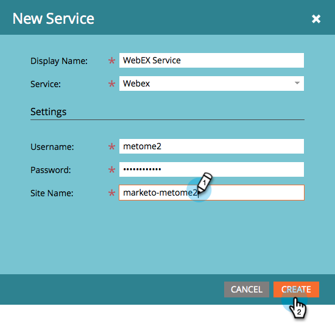

# Adicionar [!DNL Webex] como um Serviço [!DNL LaunchPoint] {#add-webex-as-a-launchpoint-service}

O Marketo Engage gerencia o registro e a participação no webinário do [!DNL Webex]. Você deve ter uma assinatura existente para [[!UICONTROL Webex]](https://www.webex.com/).

>[!NOTE]
>
>**Permissões de administrador são necessárias**

1. Vá para a área **[!UICONTROL Administrador]**.

   

1. Clique em **[!UICONTROL LaunchPoint]**.

   

1. Selecione **[!UICONTROL Novo]** e depois **[!UICONTROL Novo serviço]**.

   

1. Insira um **[!UICONTROL Nome para Exibição]**. No menu suspenso **[!UICONTROL Serviço]**, selecione **[!UICONTROL Webex Webinars]**.

   

1. Clique Em **[!UICONTROL Fazer Logon Nos Webex]**.

   

1. O Webex será aberto em uma nova guia. Faça logon usando as credenciais da Webex.

   

1. Após o logon bem-sucedido, a guia será fechada e o modal _Novo serviço_ no Marketo Engage lerá &quot;Conta de webinários da Webex definida.&quot; Clique em **[!UICONTROL Criar]**.

   

Seu **[!DNL Webex]** agora está sincronizado com o Marketo.

>[!MORELIKETHIS]
>
>[Criar um Evento com [!DNL Webex]](/help/marketo/product-docs/demand-generation/events/create-an-event/create-an-event-with-webex.md){target="_blank"}.
