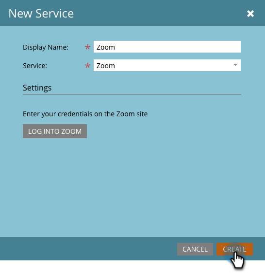

# Adicionar [!DNL Zoom] como um Serviço [!DNL LaunchPoint] {#add-zoom-as-a-launchpoint-service}

O Marketo gerencia sua inscrição e presença no [!DNL Zoom].

>[!NOTE]
>
>**Permissões de administrador são necessárias**

>[!NOTE]
>
>Uma assinatura existente para [!DNL Zoom] e direitos administrativos são necessários para esta etapa. Disponibilizar o email e a senha que você usa para entrar no [!DNL Zoom].

1. Vá para a área **[!UICONTROL Administrador]**.

   

1. Clique em **[!UICONTROL LaunchPoint]**.

   

1. Selecione **[!UICONTROL Novo]** e depois **[!UICONTROL Novo serviço]**.

   

1. Insira um **[!UICONTROL Nome para Exibição]**. Em **[!UICONTROL Serviço]**, selecione **[!UICONTROL Zoom]**.

   

1. Clique em **[!UICONTROL Logon no Zoom]**.

   

1. Na janela de logon do [!DNL Zoom], digite suas credenciais do [!DNL Zoom] e clique em **[!UICONTROL Entrar]**.

   

1. Após fechar a janela, clique em **[!UICONTROL Criar]**.

   

Sua conta do [!DNL Zoom] foi sincronizada com o Marketo e pode ser encontrada na área [!UICONTROL LaunchPoint].

>[!CAUTION]
>
>Ao atualizar sua senha no [!DNL Zoom], você também deve atualizá-la no Marketo.

>[!MORELIKETHIS]
>
>Saiba como [criar um evento com [!DNL Zoom]](/help/marketo/product-docs/demand-generation/events/create-an-event/create-an-event-with-zoom.md).
