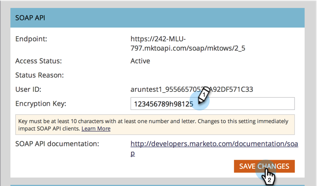

# Definição das Configurações de API SOAP {#configuring-your-soap-api-settings}

>[!NOTE]
>
>Sugerimos usar a REST API. Saiba mais sobre [developer.adobe.com](https://developer.adobe.com/marketo-apis/).

>[!NOTE]
>
>**Permissões de administrador necessárias**

1. Vá para a **[!UICONTROL Admin]** área.

   

1. Clique em **[!UICONTROL Serviços da Web]**.

   

1. Defina um apropriado **[!UICONTROL Chave de criptografia]**, clique em **[!UICONTROL Salvar alterações]**, e transmita todas as informações ao seu Desenvolvedor.

   

>[!CAUTION]
>
>Seu terminal SOAP e [!UICONTROL ID de usuário] será única; não envie a captura de tela deste artigo para o seu desenvolvedor.

>[!MORELIKETHIS]
>
>[Documentação da API SOAP](https://experienceleague.adobe.com/en/docs/marketo-developer/marketo/soap/soap-api)
