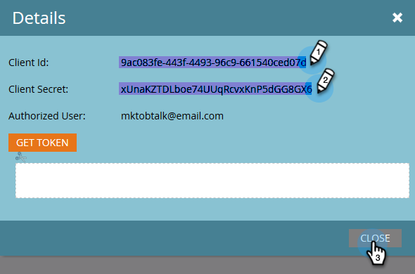

# Conectar [!DNL BrightTALK] ao Marketo {#connect-brighttalk-to-marketo}

Saiba como conectar o canal do [!DNL BrightTALK] à instância do Marketo. Para fazer isso, você deve ser um Administrador para ambos.

>[!NOTE]
>
>**Permissões de administrador necessárias**

## Etapas em [!DNL BrightTALK] {#steps-in-brighttalk}

1. Faça logon em [business.brighttalk.com/demandcentral](https://business.brighttalk.com/demandcentral/login){target="_blank"} e clique em **[!UICONTROL Conectar Agora]**.
1. Em [!UICONTROL Conector avançado do Marketo], clique em **[!UICONTROL Conectar]**.
1. Você chegará à tela de credenciais solicitando: ID do cliente, Segredo do cliente, URL do serviço de identidade e URL do serviço Rest. Para obter essas informações, faça logon no Marketo.

## Etapas no Marketo {#steps-in-marketo}

>[!NOTE]
>
>Neste ponto, será necessário configurar um [!DNL API Only User Role] e [!DNL API User] para restringir quais permissões [!DNL BrightTALK] terá na sua instância do Marketo. Como já temos artigos para essas etapas, vincularemos você a elas.

1. Crie uma [Função de Usuário Somente API](/help/marketo/product-docs/administration/users-and-roles/create-an-api-only-user-role.md){target="_blank"}.

1. [Criar um Usuário de API](/help/marketo/product-docs/administration/users-and-roles/create-an-api-only-user.md){target="_blank"}, usando a Função de API [!DNL BrightTALK] que você criou durante a Etapa 4.

1. Volte para a área **[!UICONTROL Administrador]**.

   

1. Em **[!UICONTROL Integração]**, clique em **[!UICONTROL LaunchPoint]**.

   

1. Clique no menu suspenso **[!UICONTROL Novo]** e selecione **[!UICONTROL Novo serviço]**.

   

1. Insira um **[!UICONTROL Nome para Exibição]** de sua escolha. Clique no menu suspenso **[!UICONTROL Serviço]** e selecione **[!UICONTROL Personalizado]** (_não_ selecione [!DNL BrightTALK]).

   

   >[!CAUTION]
   >
   >Lembre-se de não selecionar [!DNL BrightTALK] no menu suspenso. Este é um campo que estamos removendo, e selecioná-lo pode criar problemas significativos com a integração do [!DNL Marketo/BrightTALK].

1. Insira uma [!UICONTROL Descrição] de sua escolha. Clique no menu suspenso **[!UICONTROL Somente Usuário da API]** e selecione o [!DNL BrightTALK API User] que você criou durante a Etapa 5. Clique em **[!UICONTROL Criar]**.

   

1. Clique em **[!UICONTROL Exibir Detalhes]** para obter o serviço personalizado que você acabou de criar.

   

1. Copie (e salve) a **[!UICONTROL ID do Cliente]** e o **[!UICONTROL Segredo do Cliente]**. Clique em **[!UICONTROL Fechar]**.

   

1. Em **[!UICONTROL Integração]**, selecione **[!UICONTROL Serviços da Web]**.

   

1. Em **[!UICONTROL Rest API]**, copie (e salve) o **[!UICONTROL Ponto de extremidade]** e a **[!UICONTROL Identidade]**.

   

## Etapas Adicionais em [!DNL BrightTALK] {#additional-steps-in-brighttalk}

1. Retorne à tela de configuração do conector [!DNL BrightTALK] da Etapa 3 e insira as credenciais salvas nas Etapas 12 e 14.

Depois que as credenciais forem autenticadas, você terá conectado oficialmente o [!DNL BrightTALK] à Marketo. A próxima etapa é determinar [quais campos de dados você deseja sincronizar](https://support.brighttalk.com/hc/en-us/articles/115005131274-BrightTALK-Connector-for-Marketo-Choose-the-Fields-to-Sync){target="_blank"}.
