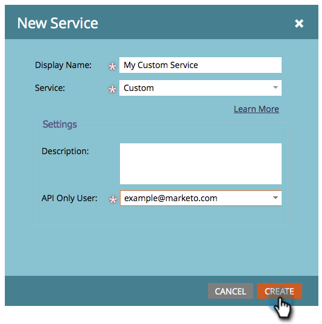

# Criar um serviço personalizado para usar com a API REST {#create-a-custom-service-for-use-with-rest-api}

Se quiser integrar ao Marketo por meio da API ReST, crie um serviço personalizado.

>[!PREREQUISITES]
>
>* [Criar uma função de usuário somente API](/help/marketo/product-docs/administration/users-and-roles/create-an-api-only-user-role.md)
>* [Criar um Usuário Somente de API](/help/marketo/product-docs/administration/users-and-roles/create-api-only-user.md)
>

>[!NOTE]
>
>**Permissões de administrador são necessárias**

>[!TIP]
>
>Consulte a documentação de desenvolvedores para obter detalhes sobre a [REST API](https://developer.adobe.com/marketo-apis/).

## Criar serviço personalizado {#create-custom-service}

1. Vá para a área **[!UICONTROL Administrador]**.

   

1. Clique em **[!UICONTROL LaunchPoint]**.

   

1. Selecione **[!UICONTROL Novo]** e depois **[!UICONTROL Novo serviço]**.

   

1. Digite um **[!UICONTROL Nome para Exibição]** para o serviço. Selecione o **[!UICONTROL Usuário Somente API]** [criado anteriormente](/help/marketo/product-docs/administration/users-and-roles/create-api-only-user.md).

   

1. Clique em **[!UICONTROL Criar]**.

   

   O serviço foi criado. Recupere as credenciais para fornecer acesso.

## Credenciais para acesso à API {#credentials-for-api-access}

1. Vá para a área **[!UICONTROL Administrador]**.

   

1. Clique em **[!UICONTROL LaunchPoint]**.

   

1. Clique em **[!UICONTROL Exibir Detalhes]** para o serviço [!UICONTROL LaunchPoint] personalizado criado acima.

   

1. Clique em **[!UICONTROL Obter token]**.

   

1. Forneça a **[!UICONTROL ID do Cliente]**, o **[!UICONTROL Segredo do Cliente]**, o **[!UICONTROL Usuário Autorizado]** e o **[!UICONTROL Token]** à pessoa encarregada de estabelecer a conexão.

   

>[!CAUTION]
>
>Não compartilhe essas informações, pois elas fornecem acesso aos seus dados.
