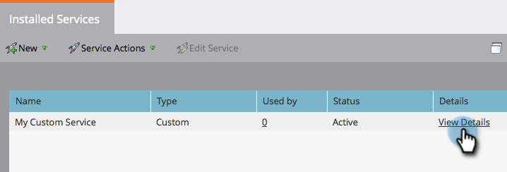

# Criar um serviço personalizado para uso com a API ReST {#create-a-custom-service-for-use-with-rest-api}

Se quiser integrar com o Marketo por meio da API ReST, crie um serviço personalizado. Veja como.

>[!PREREQUISITES]
>
>* [Criar uma função de usuário somente de API](/help/marketo/product-docs/administration/users-and-roles/create-an-api-only-user-role.md)
>* [Criar um usuário somente de API](/help/marketo/product-docs/administration/users-and-roles/create-an-api-only-user.md)
>

>[!NOTE]
>
>**Permissões de administrador necessárias**

>[!TIP]
>
>Consulte a documentação de nossos desenvolvedores para obter detalhes sobre o [ReST API](https://developers.marketo.com/documentation/rest/). Também temos o [API SOAP](https://developers.marketo.com/documentation/soap/) se é disso que você precisa.

## Criar serviço personalizado {#create-custom-service}

1. Vá para o **Administrador** área.

   

1. Clique em **LaunchPoint**.

   

1. Selecionar **Novo** e depois **Novo Serviço**.

   

1. Insira um **Nome de exibição** para o serviço. Selecione o **Usuário somente API** [criado anteriormente](/help/marketo/product-docs/administration/users-and-roles/create-an-api-only-user.md).

   

   >[!NOTE]
   >
   >Observe que já temos integração nativa para serviços populares de webinar.

1. Clique em **Criar**.

   

   Sim! O serviço foi criado, vamos continuar e obter todas as credenciais para fornecer acesso.

## Credenciais para o Acesso à API {#credentials-for-api-access}

1. Vá para o **Administrador** área.

   

1. Clique em **LaunchPoint**.

   

1. Clique em **Exibir detalhes** para o serviço personalizado do LaunchPoint criado acima.

   

1. Clique em **Obter token**.

   

1. Forneça a **ID do cliente**, **Segredo do cliente**, **Usuário autorizado** e **Token** à pessoa encarregada do estabelecimento da ligação.

   

>[!CAUTION]
>
>Não compartilhe essas informações; é o backdoor para seus dados. Mantenha seguro!
