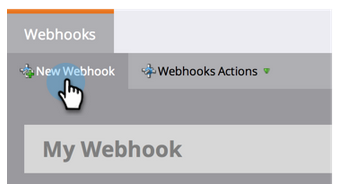

# Criar um [!DNL Webhook] {#create-a-webhook}

Use o [!DNL Webhooks] para aproveitar os serviços Web de terceiros para enviar mensagens de texto, expandir os dados da pessoa e muito mais.

1. Vá para a área **[!UICONTROL Administrador]**.

   

1. Clique em **[!UICONTROL Webhooks]**.

   

1. Clique em **[!UICONTROL Novo Webhook]**.

   

1. Nomeie e configure seu [!DNL Webhook].

   

   >[!NOTE]
   >
   >Isso geralmente inclui inserir suas credenciais de serviço de terceiros como um parâmetro de URL ou no modelo POST.

   * **[!UICONTROL URL]**: insira a URL usada em sua solicitação para o serviço Web. Para inserir um token, como o endereço de email da pessoa (**`{{lead.Email Address}}`**), em sua solicitação, clique em **[!UICONTROL Inserir token]**.

   * **[!UICONTROL Modelo]**: se quiser transmitir informações no corpo da solicitação, insira-as por meio do modelo de carga. Modelos permitidos para os seguintes tipos de solicitação: POST, DELETE, PATCH ou PUT. Você pode usar formatos de dados como JSON ou XML. Para inserir um token no modelo, clique em **[!UICONTROL Inserir Token]**.

   * **[!UICONTROL Solicitar Codificação de Token]**: se os valores de token incluírem caracteres especiais (como um E comercial, &quot;&amp;&quot;), indique o formato da sua solicitação (**JSON** ou **Form/Url**).

   * **[!UICONTROL Tipo de resposta]**: selecione o formato da resposta recebida do serviço (**JSON** ou **XML**).

   * **[!UICONTROL Tipo de Solicitação]**: Selecione o método HTTP a ser usado (DELETE, GET, PATCH, POST, PUT).

1. Clique em **[!UICONTROL Criar]**.

   

>[!NOTE]
>
>Saiba mais no aprofundamento de [[!DNL Webhooks]](https://experienceleague.adobe.com/en/docs/marketo-developer/marketo/webhooks/webhooks){target="_blank"}.
