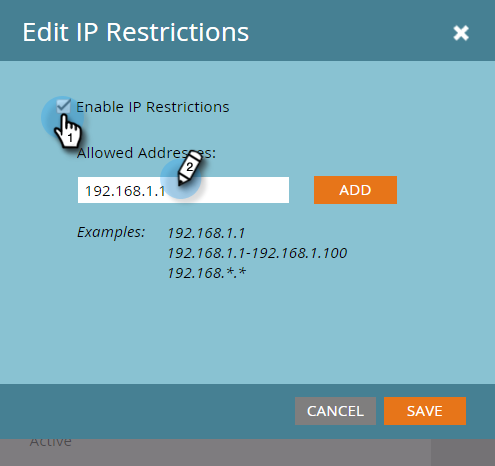

# Criar uma Inclui na lista de permissões para Acesso à API com base em IP {#create-an-allowlist-for-ip-based-api-access}

Às vezes, você deseja conceder à API acesso somente a um endereço IP específico ou a um intervalo de endereços. Para fazer isso, primeiro habilite as restrições e, em seguida, especifique os endereços IP que podem usar as APIs.

>[!NOTE]
>
>**Permissões de administrador necessárias**

1. Vá para a área **[!UICONTROL Administrador]**.

   

1. Clique em **[!UICONTROL Serviços da Web]**.

   

1. Na área **[!UICONTROL Restrições de IP]**, clique em **[!UICONTROL Editar],** ou em **[!UICONTROL Editar Restrições de IP]** no canto superior esquerdo.

   

1. Incluir na lista de permissões Marque a caixa **[!UICONTROL Habilitar Restrições de IP]** e insira os endereços IP que deseja modificar.

   

   >[!NOTE]
   >
   >Você pode inserir um único endereço IP ou um intervalo deles, ou usar um curinga.

1. Clique em **[!UICONTROL Adicionar]** para abrir campos adicionais para inserir mais endereços IP.

   

1. Clique em **[!UICONTROL Salvar]**.

   
