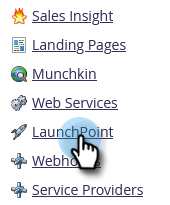

# Baixar Log de Atividades [!DNL Google Adwords] {#download-googleadwords-activity-log}

Saiba como baixar o registro de atividades para solucionar problemas.

1. Vá para a área **[!UICONTROL Administrador]**.

   

1. Clique em **[!UICONTROL LaunchPoint]**.

   

1. Encontre o serviço [!DNL Google AdWords] e clique em **[!UICONTROL Baixar Log de Atividades]**.

   

1. Um arquivo .zip é baixado no computador.
