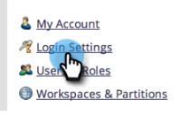
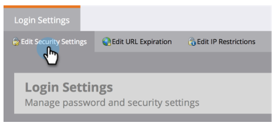

# Logon de usuário restrito apenas a SSO {#restrict-user-login-to-sso-only}

Se você estiver [usando SSO](/help/marketo/product-docs/administration/additional-integrations/add-single-sign-on-to-a-portal.md) e quiser garantir que os usuários não possam ignorar a segurança SSO, siga estas instruções.

>[!IMPORTANT]
>
>Este artigo não se aplica a [assinaturas do Marketo habilitadas para Adobe IMS](/help/marketo/product-docs/administration/marketo-with-adobe-identity/adobe-identity-management-overview.md).

>[!NOTE]
>
>**Permissões de administrador são necessárias**

1. Vá para a área **[!UICONTROL Administrador]**.

   

1. Clique em **[!UICONTROL Configurações de logon]**.

   

1. Clique em **[!UICONTROL Editar configurações de segurança]**.

   

1. Expanda as configurações **[!UICONTROL Avançadas]**, marque **[!UICONTROL Solicitar SSO]** e clique em **[!UICONTROL Salvar]**.

>[!NOTE]
>
>A prática recomendada é que os usuários sejam convidados e aceitem o convite. _Depois_ que o convite for aceito, os administradores devem defini-los como &quot;[!UICONTROL Exigir SSO].&quot;

>[!TIP]
>
>Se você selecionar **[!UICONTROL Exigir SSO]**, poderá excluir uma [função de usuário](/help/marketo/product-docs/administration/users-and-roles/create-delete-edit-and-change-a-user-role.md) dessa restrição marcando a opção **[!UICONTROL Ignorar Logon Único]** ao configurar a função. Isso permite que os usuários façam logon normalmente. Por exemplo, os usuários administradores ainda podem precisar fazer logon no Marketo por meio da tela de logon. Se o SSO e a Universal ID estiverem habilitados, você deve ter a permissão &quot;Ignorar logon único&quot; definida para alternar entre as assinaturas.

>[!CAUTION]
>
>Quando novos usuários são convidados, eles recebem emails de convite. No entanto, se **[!UICONTROL Exigir SSO]** for selecionado, eles não receberão esses emails, a menos que sejam atribuídos a uma função definida como **[!UICONTROL Ignorar Logon Único]**.

Agora todos os usuários (exceto os usuários com permissão para ignorar o logon único) estão restritos a usar somente o logon com SSO.

>[!MORELIKETHIS]
>
>* [Adicionar Logon Único a um Portal](/help/marketo/product-docs/administration/additional-integrations/add-single-sign-on-to-a-portal.md)
>* [Convidando Usuários do Marketo para Duas Instâncias com Universal ID](https://nation.marketo.com/t5/Knowledgebase/Inviting-Marketo-Users-to-Two-Instances-with-Universal-ID-UID/ta-p/251122)
