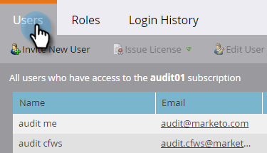

# Ativar Trilha de Auditoria {#enable-audit-trail}

A Trilha de auditoria está disponível para todos os clientes e é controlada por duas permissões de administrador.

>[!NOTE]
>
>Por padrão, todas as funções de administrador do sistema têm permissões habilitadas.

## Habilitar Trilha de Auditoria para uma Função {#enable-audit-trail-for-a-role}

1. Clique em **Admin**.

   

1. Selecione **Usuários e funções** e clique em **Funções**.

   

1. Selecione a função para a qual deseja habilitar a Trilha de auditoria e clique em **Editar função**.

   

   >[!NOTE]
   >
   >Você também tem a opção de criar uma nova função e conceder a ela acesso à Trilha de auditoria.

1. Expanda a permissão **Access Admin**. Selecione **Acessar Trilha de Auditoria** e/ou **Acessar Histórico de Logon**, dependendo de suas necessidades. Clique em **Salvar**.

   

   >[!NOTE]
   >
   >**Definição**
   >
   >
   >**Trilha de auditoria de acesso:** concede aos usuários acesso à Trilha de auditoria de ativos e à Trilha de auditoria de administração.
   >
   >
   >**Histórico de logon de acesso:** concede aos usuários acesso ao Histórico [ de logon de ](user-login-history.md)usuário.

## Atribuir função de trilha de auditoria a um usuário {#assign-audit-trail-role-to-a-user}

>[!PREREQUISITES]
>
>[Crie ](http://docs.marketo.com/display/DOCS/Create,+Delete,+Edit+and+Change+a+User+Role#Create,Delete,EditandChangeaUserRole-CreateaRole) ou   ative a função existente, dando a ela permissões de Trilha de auditoria.

1. Em **Usuários e funções**, clique em **Usuários**.

   

1. Selecione o usuário ao qual você deseja conceder acesso à Trilha de auditoria e clique em **Editar usuário**.

   

   >[!NOTE]
   >
   >Esse processo também se aplica quando você está criando um novo usuário.

1. Selecione as funções de Trilha de auditoria que você criou. Neste exemplo, criamos &quot;Trilha de auditoria - Ativo e administrador&quot; e &quot;Trilha de auditoria - com histórico de logon&quot;.

   

   >[!CAUTION]
   >
   >Se você tiver espaços de trabalho ativados, verifique a caixa de seleção da função, que seleciona todos os espaços de trabalho. Desmarcar um espaço de trabalho individual ocultará a Trilha de auditoria. Isso significa que você verá os dados de Trilha de auditoria para cada espaço de trabalho. Você tem a opção de ocultar espaços de trabalho quando [filtrar](http://docs.marketo.com/display/DOCS/Filtering+in+Audit+Trail).

1. Clique em **Salvar**.

   

