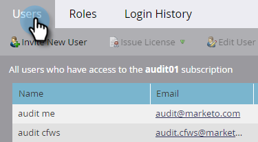

# Ativar Trilha de Auditoria {#enable-audit-trail}

A trilha de auditoria está disponível para todos os clientes e é controlada por duas permissões de administrador.

>[!NOTE]
>
>Por padrão, todas as funções de administrador do sistema têm as duas permissões habilitadas.

## Habilitar Trilha de Auditoria para uma Função {#enable-audit-trail-for-a-role}

1. Clique em **Administrador**.

   

1. Selecionar **Usuários e funções** e clique em **Funções**.

   

1. Selecione a função para a qual deseja ativar a Trilha de Auditoria e clique em **Editar função**.

   

   >[!NOTE]
   >
   >Você também tem a opção aqui para criar uma nova função e conceder a ela acesso à Trilha de auditoria.

1. Expanda o **Administrador de acesso** permissão. Selecionar **Acessar trilha de auditoria** e/ou **Histórico de logon de acesso**, dependendo de suas necessidades. Clique em **Salvar**.

   

   >[!NOTE]
   >
   >**Definição**
   >
   >**Trilha de auditoria de acesso:** Fornece aos usuários acesso à Trilha de auditoria de ativos e à Trilha de auditoria de administração.
   >
   >**Histórico de logon de acesso:** Concede aos usuários acesso ao [Histórico de logon do usuário](/help/marketo/product-docs/administration/audit-trail/user-login-history.md).

## Atribuir função de trilha de auditoria a um usuário {#assign-audit-trail-role-to-a-user}

>[!PREREQUISITES]
>
>[Criar](/help/marketo/product-docs/administration/users-and-roles/create-delete-edit-and-change-a-user-role.md#create-a-role) ou [habilitar](#enable-audit-trail) uma função existente, dando a ela permissões de Trilha de auditoria.

1. Em **Usuários e funções**, clique em **Usuários**.

   

1. Selecione o usuário ao qual deseja conceder acesso à Trilha de auditoria e clique em **Editar usuário**.

   

   >[!NOTE]
   >
   >Esse processo também se aplica quando você está criando um novo usuário.

1. Selecione as funções da Trilha de Auditoria que você criou. Neste exemplo, criamos &quot;Trilha de auditoria - Ativo e administrador&quot; e &quot;Trilha de auditoria - com histórico de logon&quot;.

   

   >[!CAUTION]
   >
   >Se você tiver espaços de trabalho ativados, marque a caixa de seleção da função, que seleciona todos os espaços de trabalho. Desmarcar um espaço de trabalho individual ocultará a Trilha de auditoria. Isso significa que você verá os dados da Trilha de auditoria para cada espaço de trabalho. Você tem a opção de ocultar espaços de trabalho quando [filtragem](/help/marketo/product-docs/administration/audit-trail/filtering-in-audit-trail.md).

1. Clique em **Salvar**.

   
