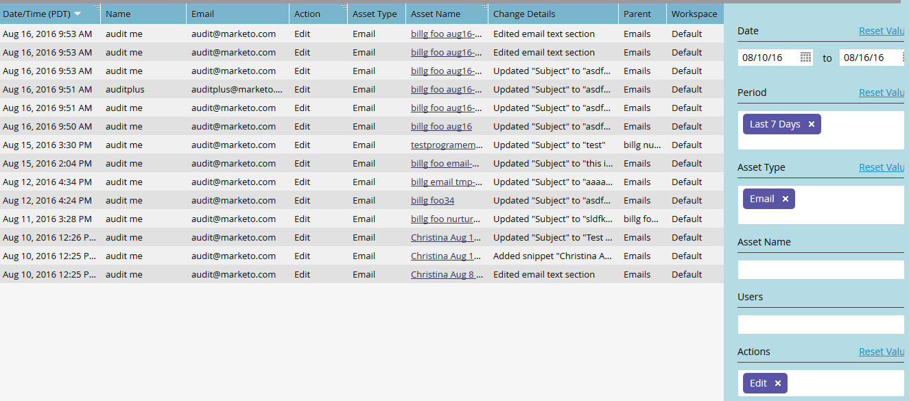

# Filtragem na trilha de auditoria {#filtering-in-audit-trail}

Filtre por intervalo de tempo, tipo de ativo, usuários, ações realizadas e muito mais.

1. Clique em **[!UICONTROL Administrador]**.

   

1. Em **[!UICONTROL Segurança]**, selecione **[!UICONTROL Trilha de Auditoria]**.

   

1. Clique no ícone de filtro.

   

   >[!NOTE]
   >
   >Há várias combinações possíveis de parâmetros de pesquisa. Neste exemplo, localizamos: _todos os emails - editados por qualquer pessoa - nos sete dias anteriores_.

1. Clique no menu suspenso **[!UICONTROL Período]** e selecione **[!UICONTROL Últimos 7 dias]**.

   

1. Clique no menu suspenso **[!UICONTROL Tipo de ativo]** e selecione **[!UICONTROL Email]**.

   

1. Clique no menu suspenso **Actions** e selecione **[!UICONTROL Editar]**.

   

1. Clique em **[!UICONTROL Aplicar]**.

   

1. Os resultados filtrados são exibidos à esquerda.

   

   Pronto!

   >[!NOTE]
   >
   >Se você tiver espaços de trabalho ativados, verá dados de auditoria para todos os espaços de trabalho. Se você aplicar um filtro de espaço de trabalho, o Marketo lembrará do valor anterior sempre que você usar a trilha de auditoria. As permissões do Workspace no nível do ativo são aplicadas.

   >[!MORELIKETHIS]
   >
   >[Detalhes da alteração na trilha de auditoria](/help/marketo/product-docs/administration/audit-trail/change-details-in-audit-trail.md)
