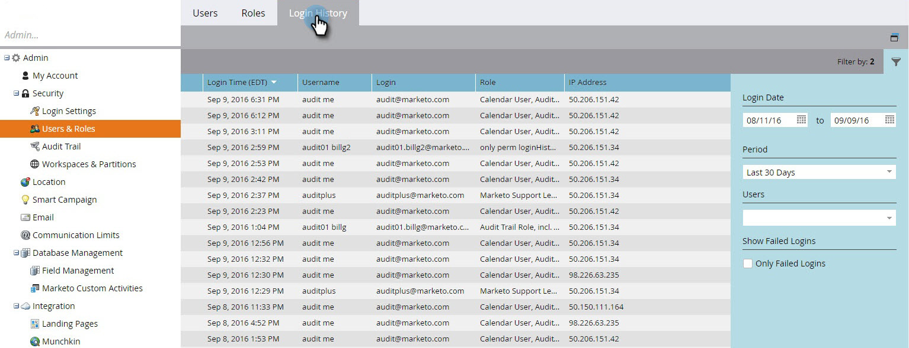

# Histórico de logon do usuário {#user-login-history}

O Histórico de logon do usuário ajuda a manter a responsabilidade e a segurança, mostrando exatamente quem está fazendo logon na sua assinatura, incluindo tentativas de logon com falha.

>[!PREREQUISITES]
>
>Você deve ter uma função com a permissão Acessar histórico de logon ativada para visualizar o histórico de logon do usuário.

O Histórico de logon do usuário identifica as pessoas que fazem logon por:

* Data e hora de logon
* Nome e endereço de email do usuário
* Função
* Espaço de trabalho
* Endereço IP

Para exibir o Histórico de Login do Usuário:

1. Vá para a área **[!UICONTROL Administrador]**.

   

1. Em Segurança, clique em **[!UICONTROL Usuários e funções]**.

   

1. Clique na guia **[!UICONTROL Histórico de Logon]**. A lista mostra os logons mais recentes.

   

1. Use o Filtro para restringir sua pesquisa.

   

1. Selecione um intervalo de datas usando os seletores de data.

   

1. Ou escolha no menu suspenso.

   

1. Selecione os usuários no menu suspenso **[!UICONTROL Usuários]**.

   

1. Marque a caixa **[!UICONTROL Somente Logons com Falha]** para exibir somente os logons com falha em sua pesquisa.

   

1. Clique em **[!UICONTROL Aplicar]**.

   

   >[!NOTE]
   >
   >A interface do usuário do exibe até 30 dias de dados. Se precisar de mais, você pode baixar os seis meses mais recentes de dados para um arquivo csv.

   >[!MORELIKETHIS]
   >
   >[Visão geral da trilha de auditoria](/help/marketo/product-docs/administration/audit-trail/audit-trail-overview.md)
