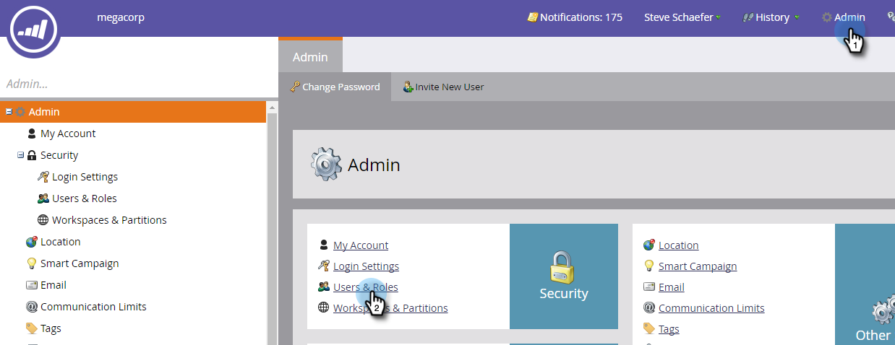
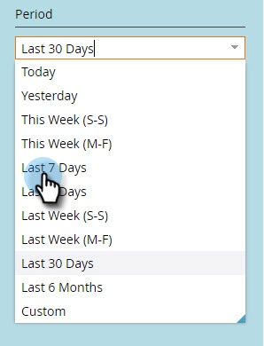

# Histórico de logon do usuário {#user-login-history}

O Histórico de logon do usuário ajuda a manter a responsabilidade e a segurança, mostrando exatamente quem está fazendo logon em sua subscrição, incluindo tentativas de login com falha.

>[!NOTE]
>
>**Pré-requisitos**
>
>Você deve ter uma função com a permissão Histórico de logon de acesso ativada para visualização do Histórico de logon do usuário.

O Histórico de logon do usuário identifica as pessoas que fazem logon por:

* Data e hora de login
* Nome e endereço de email do usuário
* Função
* Área de trabalho
* Endereço IP

Para visualização do Histórico de logon do usuário:

1. Clique na guia **Admin** e, em Segurança, clique em **Usuários e funções**.

   

1. Clique na guia Histórico **de** logon. A lista mostra os logons mais recentes.

   

1. Use o Filtro para restringir sua pesquisa.

   

1. Selecione um intervalo de datas usando os seletores de datas.

   

1. Ou, escolha na lista suspensa.

   

1. Selecione os usuários no menu suspenso **Usuários** .*** **

   ** 

   **

1. Marque a caixa **Somente logons** com falha para exibir somente logons com falha na sua pesquisa.

   

1. Clique em **Aplicar**.

   

   >[!NOTE]
   >
   >A interface do usuário exibe até 30 dias de dados. Se precisar de mais, você pode baixar os seis meses mais recentes de dados em um arquivo csv.

   >[!NOTE]
   >
   >**Artigos relacionados**
   >
   >    
   >    
   >    * [Visão geral da trilha de auditoria](audit-trail-overview.md)

