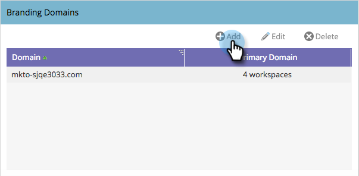

# Adicionar um domínio de marca adicional com espaços de trabalho {#add-an-additional-branding-domain-with-workspaces}

Se você tiver espaços de trabalho, poderá adicionar outros domínios de marca.

>[!PREREQUISITES]
>
>Primeiro, você deve [editar seu domínio](edit-your-default-branding-domain.md) de marca padrão.
>
>Primeiro, você deve [substituir o link](edit-your-default-branding-domain-with-workspaces.md) de rastreamento genérico por um domínio de marca antes de adicionar outros domínios de marca.

1. Vá para **Admin **e clique em **Email**.

   

1. Clique em **Adicionar **para adicionar um domínio de marca adicional.

   

1. Insira um novo domínio de marca. Clique em **Avançar**.

   

   >[!NOTE]
   >
   >Você pode optar por tornar este Domínio Principal para um ou mais espaços de trabalho, e todos os emails não enviados existentes definidos como &quot;Padrão&quot; e todos os emails recém-criados serão definidos como padrão para o domínio primário. É possível substituir isso por email.

1. Selecione o novo domínio de marca e clique em **Salvar**.

   

