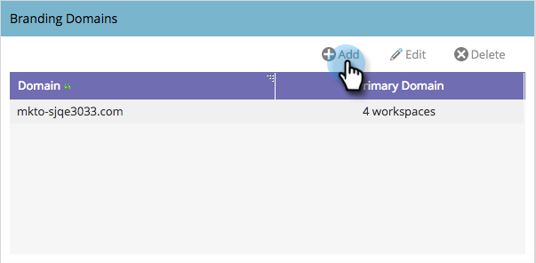
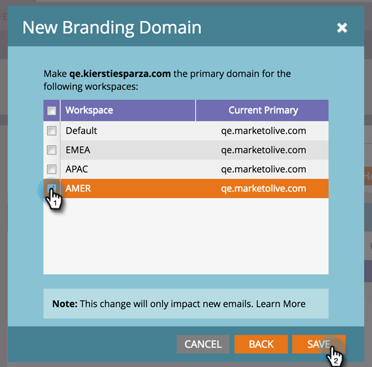

# Adicionar um novo domínio de marca com espaços de trabalho {#add-an-additional-branding-domain-with-workspaces}

Se você tiver espaços de trabalho, poderá adicionar outros domínios de marca.

>[!PREREQUISITES]
>
>* [Editar seu domínio de marca padrão](/help/marketo/product-docs/administration/email-setup/add-multiple-branding-domains/edit-your-default-branding-domain.md).
>
>* [Substitua o link de rastreamento genérico](/help/marketo/product-docs/administration/email-setup/add-multiple-branding-domains/edit-your-default-branding-domain-with-workspaces.md) por um domínio de marca antes de adicionar outros domínios de marca.

1. Vá para a área **[!UICONTROL Administrador]**.

   

1. Clique em **[!UICONTROL Email]**.

   

1. Clique em **[!UICONTROL Adicionar]** para adicionar outro domínio de marca.

   

1. Insira um novo domínio de marca. Clique em **[!UICONTROL Next]**.

   

   >[!NOTE]
   >
   >Você pode optar por tornar esse domínio primário para um ou mais espaços de trabalho, e todos os emails não enviados existentes definidos como &quot;Padrão&quot; e todos os emails recém-criados assumirão o domínio primário como padrão. Você pode substituí-lo por email.

1. Selecione o novo domínio de identidade visual e clique em **[!UICONTROL Salvar]**.

   
