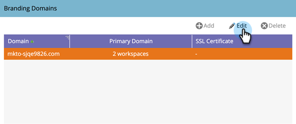
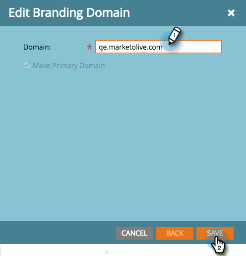

# Editar o domínio de marca padrão {#edit-your-default-branding-domain}

A edição do domínio de marca padrão é a primeira etapa do trabalho com domínios de marca.

>[!PREREQUISITES]
>
>Verifique se você [configurou um CNAME no DNS](/help/marketo/getting-started/initial-setup/configure-protocols-for-marketo.md){target="_blank"} antes de adicionar seus domínios de marca na Marketo.

1. Vá para a área **[!UICONTROL Administrador]**.

   

1. Clique em **[!UICONTROL Email]**.

   

1. Na tabela [!UICONTROL Domínios de Identidade Visual], selecione o domínio genérico e clique em **[!UICONTROL Editar]** para alterá-lo para o domínio de marca da sua empresa.

   

   >[!NOTE]
   >
   >Não é possível adicionar outro domínio até que você edite o domínio genérico pela primeira vez.

1. Insira o nome do seu domínio padrão e clique em **[!UICONTROL Salvar]**.

   

Agora você pode [adicionar outros domínios de marca](/help/marketo/product-docs/administration/email-setup/add-multiple-branding-domains/add-an-additional-branding-domain.md){target="_blank"} necessários.

>[!NOTE]
>
>Se precisar atualizar ou remover um SSL existente, contate o [Suporte da Marketo](https://nation.marketo.com/t5/support/ct-p/Support){target="_blank"}.
