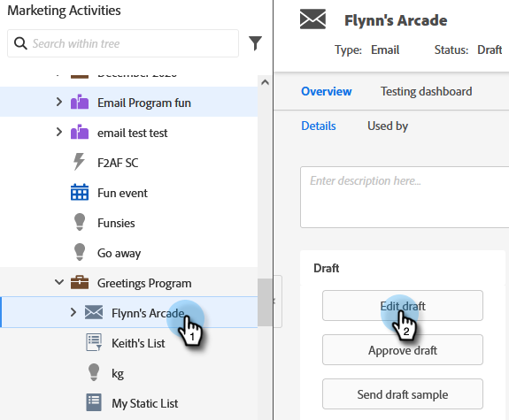

# Substituir domínio primário dos emails {#overwrite-primary-domain-for-emails}

Você pode substituir o domínio primário da marca por email. Isso alterará a forma como os links são marcados quando o email é enviado.

1. Acesse **[!UICONTROL Atividades de marketing]**.

   

1. Selecione um email e clique em **[!UICONTROL Editar rascunho]**.

   

1. Selecione o domínio de marca que deseja usar.

   

   >[!NOTE]
   >
   >Nem todos os usuários têm permissões para definir o domínio da marca com base no email. Entre em contato com seu administrador se você não visualizar o menu suspenso [!UICONTROL Domínios com marca].
