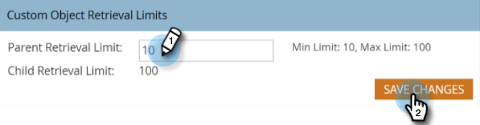

# Alterar Limites de Recuperação de Objeto Personalizado em [!DNL Velocity Scripting] {#change-custom-object-retrieval-limits-in-velocity-scripting}

Se você usar o [!DNL Velocity Script] para exibir dados de Objeto Personalizado em emails, esse recurso poderá se aplicar ao seu caso de uso. Por padrão, você tem acesso a 10 objetos personalizados principais do Velocity Script. Se precisar acessar mais, consulte as etapas abaixo.

## O que é [!DNL Velocity] {#what-is-velocity}

[[!DNL Apache Velocity]](https://velocity.apache.org/) é uma linguagem criada em [!DNL Java] projetada para modelagem e script de conteúdo HTML. O Marketo permite que ele seja usado no contexto de emails por meio do uso de [tokens de script](/help/marketo/product-docs/email-marketing/general/using-tokens/create-an-email-script-token.md). Entre outras coisas, isso dá acesso aos dados armazenados em objetos personalizados.

Você pode fazer referência a objetos personalizados pai e filho que estão conectados diretamente ao cliente potencial ou contato, mas não a objetos personalizados de terceiro nível. Para cada objeto personalizado, os 10 registros atualizados mais recentemente por pessoa/contato estão disponíveis no tempo de execução e são ordenados da atualização mais recente (em 0) para a atualização mais antiga (em 9).

## Como alterar o limite {#how-to-change-the-limit}

1. Vá para a seção **[!UICONTROL Admin]**.

   

1. Clique em **[!UICONTROL Email]**.

   

1. Na tabela [!UICONTROL Limites de Recuperação de Objeto Personalizados], insira um novo [!UICONTROL Limite de Recuperação Pai] e clique em **[!UICONTROL Salvar Alterações]**.

   

>[!NOTE]
>
>O valor de [!UICONTROL Limite de Recuperação Pai] deve estar no intervalo de 10 a 100. O [!UICONTROL Limite de Recuperação de Filho] é definido automaticamente para você. Isso é feito dividindo 1000 pelo [!UICONTROL Limite de Recuperação Pai]. Por exemplo, se você definir o limite Pai como 50, o limite Filho se tornará 20 (1000 ÷ 50 = 20).

Agora você pode acessar mais objetos personalizados em [!DNL Velocity script].
