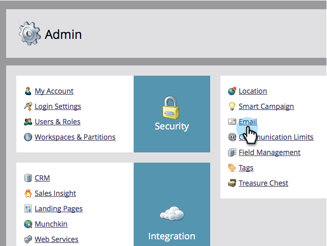

# Alterar o padrão do e-mail e do rótulo {#change-the-default-from-email-and-from-label}

Cada usuário administrador tem a capacidade de alterar os valores padrão para **Do e-mail** e **Do rótulo** para que, ao criar novos e-mails, esses padrões sejam usados.

>[!NOTE]
>
>**Permissões de administrador necessárias**

1. Vá para a seção **Admin**.

   

1. Clique em **Email**.

   

1. Digite os valores padrão que deseja para **Do e-mail** e **Do rótulo** e clique em **Salvar alterações**.

   

>[!NOTE]
>
>A alteração só se aplica a você e não a outros usuários do Marketing.

Bom trabalho! Sempre que você criar um novo email, os valores padrão definidos serão usados.