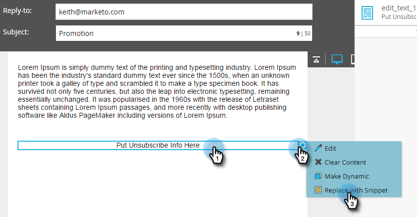
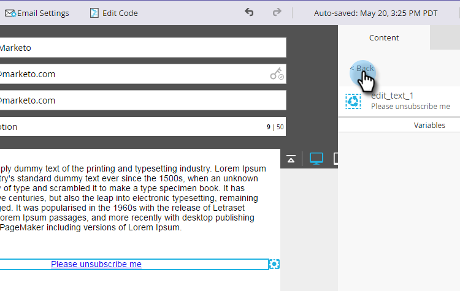
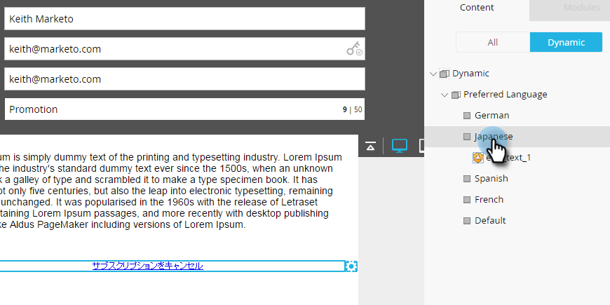

# Tornar sua mensagem de cancelamento de assinatura dinâmica para idiomas {#make-your-unsubscribe-message-dynamic-for-languages}

>[!NOTE]
>
>**FYI**
>
>O Marketo agora está padronizando o idioma em todas as subscrições, portanto você pode ver o lead/lead na sua subscrição e a pessoa/pessoas em docs.marketo.com. Estes termos significam a mesma coisa. isso não afeta as instruções do artigo. Há outras mudanças também. [Saiba mais](http://docs.marketo.com/display/DOCS/Updates+to+Marketo+Terminology).

A mensagem e o link padrão de cancelamento de inscrição estão em inglês. Você pode usar o conteúdo dinâmico para exibi-lo em idiomas diferentes.

>[!NOTE]
>
>Configuramos este belo tutorial abaixo para você. Representa uma prática recomendada, mas isso pode ser feito de outras formas.

1. Preparar seus dados
1. [Crie um](../../../../product-docs/administration/field-management/create-a-custom-field-in-marketo.md)campo personalizado chamado &quot;Idioma preferencial&quot;. (Configure-o no CRM se desejar que esse campo seja sincronizado).

   >[!TIP]
   >
   >No futuro, use esse campo ao [criar um formulário](../../../../product-docs/demand-generation/forms/creating-a-form/create-a-form.md) para capturar a preferência de idioma.

1. Criar segmentação
1. Vá para o **Banco de Dados**.
** 

   **

1. Na lista suspensa **Novo** , clique em **Nova segmentação**.

   

1. Nomeie o Idioma **** preferencial da segmentação. Clique em **Adicionar segmento**. Digite um idioma.

   

   >[!NOTE]
   >
   >O segmento padrão será inglês.

1. Continue a adicionar segmentos até que todos os idiomas sejam representados. Clique em **Criar**.

   

1. Selecione um segmento.

   

1. Vá para a guia **Lista** inteligente. Insira o Idioma **preferencial** no campo de pesquisa. Arraste e solte o filtro na tela.

   

1. Defina o idioma correspondente apropriado.

   

1. Repita o procedimento para todos os idiomas diferentes. Em seguida, selecione o menu suspenso Ações **de** segmentação e clique em **Aprovar**.

   

1. Criar um trecho
1. Vá para o **Design Studio**.

   

1. Na lista suspensa **Novo** , clique em **Novo trecho**.

   ** 

   **

1. Nomeie o snippet **Unsubscribe Message (Cancelar inscrição)**. Clique em **Criar**.

   

1. Digite sua mensagem padrão de cancelamento de assinatura, realce-a e clique no ícone de hiperlink.

   

1. Copie e cole este token: **`{{system.unsubscribeLink}}`** no campo URL **do** link. Clique em **Inserir**.

   

1. Selecione **Segmentar por** na seção Segmentação.

   

1. No menu suspenso Segmentação, digite **Preferencial** e selecione Idioma **preferencial**. Clique em **Salvar**.

   

1. Selecione um segmento na árvore. Digite sua mensagem de cancelamento de assinatura nesse idioma.

   

1. Copie e cole o mesmo token: **`{{system.unsubscribeLink}}`** no campo URL **do** link. Clique em **Inserir**.

   

1. Repita o procedimento para todos os seus segmentos. Em seguida, volte para o Design Studio, clique no menu suspenso **Snippet Actions (Ações** de trecho) e clique em **Aprovar**.

   

   Incrível. Quase lá.

1. Usar fragmento em um email
1. No editor de email, clique no elemento editável. Em seguida, clique no ícone de engrenagem e selecione **Substituir por trecho**. Se você estiver selecionando um elemento de trecho editável, clique no ícone de engrenagem e selecione **Editar**.

   

1. Localize e selecione seu trecho na lista suspensa e clique em **Salvar**.

   

1. Para testá-la, clique em **Voltar**...

   

1. ...em seguida, a guia **Dinâmico** .

   

1. Clique nos diferentes idiomas para ver a alteração do snippet.

   

   >[!TIP]
   >
   >É claro, você também pode editar o restante do seu email para um idioma dinâmico. Enquanto estiver nela, faça a mesma técnica na página de cancelamento de inscrição.

1. Personalizar sua página de cancelamento de assinatura com conteúdo dinâmico

   Se você quiser que seu pessoal acesse uma página de cancelamento de inscrição em seu idioma preferido, você poderá usar o conteúdo dinâmico na landing page e na página de confirmação.

   Navegue até o Design Studio.

   

   Digite Cancelar inscrição no campo de pesquisa. Você deve encontrar suas páginas Cancelar inscrição.

   

   Clique em Editar rascunho.

   

   Selecione Segmentar por.

   

   Encontre o segmento Idioma preferencial. Clique em Salvar.

   

   Edite seu conteúdo para cada landing page, aprove e você pode ir!

   >[!NOTE]
   >
   >**Mergulho profundo**
   >
   >
   >Saiba mais sobre o conteúdo  dinâmico e todas as coisas legais que você pode fazer.

