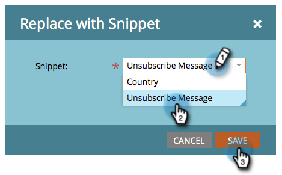

# Tornar a mensagem de cancelamento de inscrição dinâmica em diferentes idiomas {#make-your-unsubscribe-message-dynamic-for-languages}

A mensagem e o link padrão para cancelar a inscrição estão em inglês. Você pode usar o conteúdo dinâmico para exibi-lo em diferentes idiomas.

>[!NOTE]
>
>Este artigo representa uma prática recomendada, mas pode ser realizado de outras maneiras.

## Preparar seus dados {#prepare-your-data}

1. [Crie um campo personalizado](/help/marketo/product-docs/administration/field-management/create-a-custom-field-in-marketo.md) chamado &quot;Idioma preferencial&quot;. (Configure-o no CRM se desejar que esse campo seja sincronizado).

   >[!TIP]
   >
   >No futuro, use este campo quando você [criar um formulário](/help/marketo/product-docs/demand-generation/forms/creating-a-form/create-a-form.md) para capturar a preferência de idioma.

## Criar segmentação {#create-segmentation}

1. Vá para o **[!UICONTROL Banco de Dados]**.

   

1. No menu suspenso **[!UICONTROL Novo]**, clique em **[!UICONTROL Nova segmentação]**.

   

1. Nomeie a segmentação **[!UICONTROL Idioma preferencial]**. Clique em **[!UICONTROL Adicionar segmento]**. Digite um idioma.

   

   >[!NOTE]
   >
   >O segmento padrão será inglês.

1. Continue a adicionar segmentos até que todos os idiomas sejam representados. Clique em **[!UICONTROL Criar]**.

   

1. Selecione um segmento.

   

1. Vá para a guia **[!UICONTROL Smart List]**. Digite o **[!UICONTROL Idioma Preferencial]** no campo de pesquisa. Arraste e solte o filtro na tela de desenho.

   

1. Defina o idioma correspondente apropriado.

   

1. Repita o procedimento para todos os diferentes idiomas. Em seguida, selecione o menu suspenso **[!UICONTROL Ações de segmentação]** e clique em **[!UICONTROL Aprovar]**.

   

## Criar um snippet {#create-a-snippet}

1. Vá para o **[!UICONTROL Design Studio]**.

   

1. Na lista suspensa **[!UICONTROL Novo]**, clique em **[!UICONTROL Novo trecho]**.

   

1. Nomeie o trecho **Cancelar inscrição da mensagem**. Clique em **[!UICONTROL Criar]**.

   

1. Digite a mensagem de cancelamento de inscrição padrão, realce-a e clique no ícone de hiperlink.

   

1. Copie e cole este token: `{{system.unsubscribeLink}}` no campo **[!UICONTROL URL]**. Clique em **[!UICONTROL Inserir]**.

   

1. Selecione **[!UICONTROL Segmentar por]** na seção **[!UICONTROL Segmentação]**.

   

1. Na lista suspensa **[!UICONTROL Segmentação]**, digite **[!UICONTROL Preferencial]** e selecione **[!UICONTROL Idioma Preferencial]**. Clique em **[!UICONTROL Salvar]**.

   

1. Selecione um segmento na árvore. Clique no cancelamento de inscrição e no ícone de link.

   

1. Verifique se `{{system.unsubscribeLink}}` ainda está no campo **[!UICONTROL URL]**. Edite o **[!UICONTROL Exibir Texto]** para corresponder ao idioma selecionado. Clique em **[!UICONTROL Aplicar]**.

   

1. Repita o procedimento para todos os segmentos. Volte para o **[!UICONTROL Design Studio]**, clique no menu suspenso **[!UICONTROL Ações de Trecho]** e clique em **[!UICONTROL Aprovar]**.

   

Fantástico. Quase lá!

## Usar trecho em um email {#use-snippet-in-an-email}

1. No editor de email, clique no elemento editável. Em seguida, clique no ícone de engrenagem e selecione **[!UICONTROL Substituir por trecho]**. Se você estiver selecionando um elemento de trecho editável, clique no ícone de engrenagem e selecione **[!UICONTROL Editar]**.

   

1. Localize e selecione seu trecho na lista suspensa e clique em **[!UICONTROL Salvar]**.

   

1. Para testar, clique em **[!UICONTROL Voltar]**...

   

1. ...depois a guia **[!UICONTROL Dynamic]**.

   

1. Clique nos diferentes idiomas para ver a alteração do trecho.

   

   >[!TIP]
   >
   >É claro que você também pode editar o restante do seu email para linguagem dinâmica. Enquanto estiver nessa página, faça a mesma técnica na página de cancelamento de inscrição.

## Personalização da página de cancelamento de inscrição com conteúdo dinâmico {#customizing-your-unsubscribe-page-with-dynamic-content}

Se você quiser que seus funcionários acessem uma página de cancelamento de inscrição no idioma de sua preferência, é possível usar o conteúdo dinâmico na página de aterrissagem e na página de confirmação.

1. Navegue até o **[!UICONTROL Design Studio]**.

   

1. Digite _Cancelar inscrição_ no campo de pesquisa e selecione a página Cancelar inscrição desejada.

   

1. Clique em **[!UICONTROL Editar rascunho]**.

   

1. Selecione **[!UICONTROL Segmentar por]**.

   

1. Localize o segmento **[!UICONTROL Idioma Preferencial]**. Clique em **[!UICONTROL Salvar]**.

   

   Edite seu conteúdo para cada página de aterrissagem, aprove e você está pronto para prosseguir!

   >[!NOTE]
   >
   >Saiba mais sobre o [conteúdo dinâmico](/help/marketo/product-docs/personalization/segmentation-and-snippets/segmentation/understanding-dynamic-content.md) e todas as coisas interessantes que você pode fazer.
