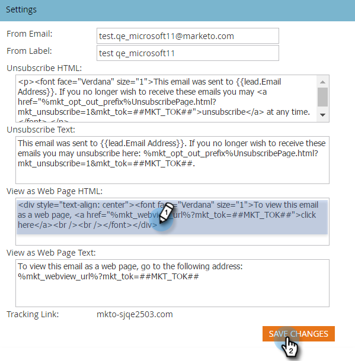

# Editar a mensagem “Exibir como uma página da web” {#edit-the-view-as-web-page-message}

Saiba como editar o texto &quot;[Exibir como página da Web](/help/marketo/product-docs/email-marketing/general/functions-in-the-editor/add-a-view-as-web-page-link-to-an-email.md)&quot;.

>[!NOTE]
>
>**Permissões de administrador são necessárias**

## Editar a mensagem “Exibir como uma página da web” {#edit-the-view-as-web-page-message-1}

1. Vá para a área **[!UICONTROL Administrador]**.

   

1. Clique em **[!UICONTROL Email]**.

   

   >[!CAUTION]
   >
   >As variáveis a seguir são críticas. Não os exclua!
   >
   >`%mkt_webview_url%?mkt_tok=##MKT_TOK##`
   >
   >A segunda parte `##MKT_TOK##` é o cookie [!UICONTROL Munchkin] dessa pessoa. Isso garante que eles sejam rastreados adequadamente ao clicar no link.

1. Edite as versões **[!UICONTROL Exibir como HTML da Página da Web]** e **[!UICONTROL Exibir como Texto da Página da Web]** de sua preferência e clique em **[!UICONTROL Salvar Alterações]**.

   

>[!CAUTION]
>
>Evite:
>
>* Adicionar URLs adicionais a qualquer uma das caixas do HTML
>* Inserção do HTML na versão de texto

Envie emails de teste para verificar a formatação.

## Texto padrão &quot;Exibir como página da Web&quot; {#default-view-as-web-page-text}

Se você precisar reverter para o sistema padrão &quot;[!UICONTROL Exibir como Página da Web]&quot;, copie/cole o seguinte:

**[!UICONTROL Exibir como HTML da Página da Web]**:

`
To view this email as a web page, <a href="%mkt_webview_url%?mkt_tok=##MKT_TOK##">click here</a>
`

**[!UICONTROL Exibir como texto da página da Web]**:

Para exibir esse email como uma página da Web, vá para o seguinte endereço:
`%mkt_webview_url%?mkt_tok=##MKT_TOK##`
