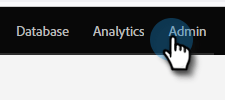
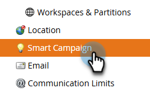

# Rastreamento de abertura de email no nível da campanha {#email-open-tracking-at-campaign-level}

Esse recurso permite controlar o rastreamento de abertura de email, uma vez para cada abertura em uma campanha ou apenas uma vez para cada email, independentemente de quantas vezes ele é usado em campanhas diferentes.

>[!NOTE]
>
>**Permissões de administrador são necessárias**

1. Vá para a área **[!UICONTROL Administrador]**.

   

1. Clique em **[!UICONTROL Campanha Inteligente]**.

   

1. Ao lado de _Configurações para aberturas de email_, clique em **[!UICONTROL Editar]**.

   

1. Clique na lista suspensa, escolha a configuração desejada e clique em **[!UICONTROL Salvar]**.

   

<table><tbody>
  <tr>
    <td><b>Habilitado</b></td>
    <td>As aberturas de email são rastreadas separadamente para cada campanha.</td>
  </tr>
  <tr>
    <td><b>Desabilitado</b></td>
    <td>As aberturas de email são contadas com base apenas nas aberturas de pessoas únicas.</td>
  </tr>
</tbody>
</table>
