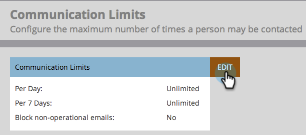
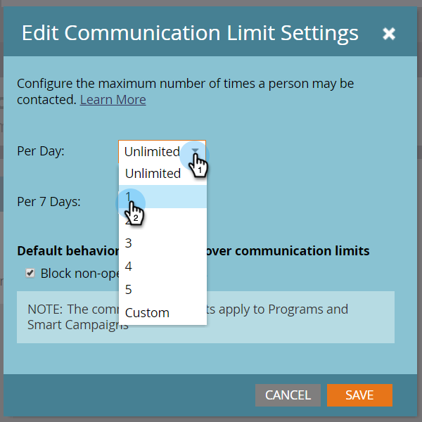

# Ativar limites de comunicação {#enable-communication-limits}

É muito importante não se comunicar demais com o seu povo. Definir limites de comunicação ajudará a impedir que sua organização envie muitos e-mails.

>[!NOTE]
>
>**Permissões de administrador necessárias**

1. Em **Admin**, clique em Limites **de** comunicação.

   
Clique em Editar.
   

   >[!NOTE]
   >
   >
   >Por dia é baseado no dia de calendário no fuso horário da subscrição (meia-noite-meia-noite).

1. Clique no menu suspenso **Por dia** e selecione o limite desejado. Neste exemplo, estamos escolhendo 1.

   

   >[!TIP]
   >
   >Você também pode escolher **Personalizado** se nenhuma das opções predefinidas funcionar para você.

1. Clique no menu suspenso **Por 7 dias** e selecione o limite desejado. Neste exemplo, estamos escolhendo 5.

   

1. Selecione **Bloquear emails** não operacionais.

   

   >[!NOTE]
   >
   >Saiba mais sobre o que são emails  operacionais.

1. Clique em **Salvar**.

   

   >[!NOTE]
   >
   >**Exemplo**
   >
   >
   >As configurações acima significam que as pessoas não receberão mais de **1 email por dia** ou mais de **5 em nenhum período** de sete dias.

   >[!NOTE]
   >
   >
   >Os limites de comunicação se aplicam automaticamente a todos os programas de email e envolvimento.

>[!NOTE]
>
>**Artigos relacionados**
>
>[Aplicar limites de comunicação à Campanha inteligente](../../../product-docs/core-marketo-concepts/smart-campaigns/using-smart-campaigns/apply-communication-limits-to-smart-campaign.md)

