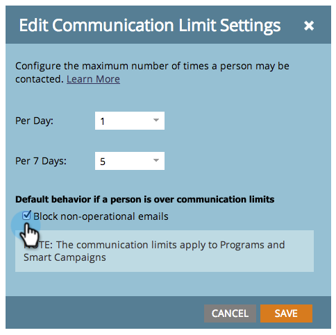

# Ativar limites de comunicação {#enable-communication-limits}

É muito importante não se comunicar demais com o seu pessoal. Definir limites de comunicação ajudará a impedir que sua organização envie muitos emails.

>[!NOTE]
>
>**Permissões de administrador necessárias**

1. Vá para a área **[!UICONTROL Administrador]**.

   

1. Clique em **[!UICONTROL Limites de comunicação]**.

   

1. Clique em **[!UICONTROL Editar]**.

   

   >[!NOTE]
   >
   >[!UICONTROL Por Dia] é baseado no dia do calendário no fuso horário da assinatura (meia-noite-meia-noite).

1. Clique na lista suspensa **[!UICONTROL Por Dia]** e selecione o limite desejado. Neste exemplo, estamos escolhendo 1.

   

   >[!TIP]
   >
   >Você também pode escolher **[!UICONTROL Personalizado]** se nenhuma das opções predefinidas funcionar para você.

1. Clique na lista suspensa **[!UICONTROL Por 7 dias]** e selecione o limite desejado. Neste exemplo, estamos escolhendo 5.

   

1. Selecione **[!UICONTROL Bloquear emails não operacionais]**.

   

   >[!NOTE]
   >
   >Saiba mais sobre os [emails operacionais](/help/marketo/product-docs/email-marketing/general/functions-in-the-editor/make-an-email-operational.md).

1. Clique em **[!UICONTROL Salvar]**.

   

   >[!NOTE]
   >
   >**Exemplo**
   >
   >As configurações acima significam que as pessoas não receberão mais de **email por dia** ou mais de **5 em qualquer período de sete dias**.

   >[!NOTE]
   >
   >Os limites de comunicação se aplicam automaticamente a todos os programas de email e engajamento.

>[!MORELIKETHIS]
>
>[Aplicar Limites de Comunicação a [!DNL Smart Campaign]](/help/marketo/product-docs/core-marketo-concepts/smart-campaigns/using-smart-campaigns/apply-communication-limits-to-smart-campaign.md)
