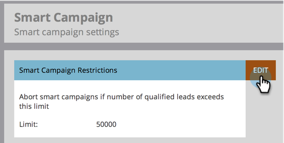

# Habilitar restrições de pessoa para campanhas inteligentes {#enable-person-restrictions-for-smart-campaigns}

Há um recurso no Marketo para limitar o número _máximo_ de pessoas que podem se qualificar para uma Campanha Inteligente. Isso evita enviar acidentalmente um email para todo o banco de dados.

>[!NOTE]
>
>**Permissões de administrador são necessárias**

>[!CAUTION]
>
>Isso se aplica somente a campanhas em lote e programas de email.

1. Vá para a área **[!UICONTROL Administrador]**.

   

1. Clique em **[!UICONTROL Campanha Inteligente]**.

   

1. Clique em **[!UICONTROL Editar]**.

   

   >[!CAUTION]
   >
   >Se o número de pessoas qualificadas para executar uma Campanha inteligente exceder o limite definido, ela não será executada.

1. Insira um limite e clique em **[!UICONTROL Salvar]**.

   

   >[!TIP]
   >
   >Desative esse recurso deixando esse campo em branco.

   >[!CAUTION]
   >
   >Esse limite é aplicado a todas as Campanhas inteligentes, mas pode ser substituído no nível da campanha. Saiba como [substituir restrições de pessoa em uma Campanha Inteligente](/help/marketo/product-docs/core-marketo-concepts/smart-campaigns/using-smart-campaigns/override-person-restrictions-in-a-smart-campaign.md).

>[!MORELIKETHIS]
>
>[Substituir restrições de pessoa em uma campanha inteligente](/help/marketo/product-docs/core-marketo-concepts/smart-campaigns/using-smart-campaigns/override-person-restrictions-in-a-smart-campaign.md)
