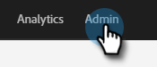

# Filtrar atividade de bot de email {#filtering-email-bot-activity}

Às vezes, a atividade de bot de email pode aumentar erroneamente seus dados de aberturas e cliques de email. Siga as etapas abaixo para corrigir isso.

Usamos três métodos separados para confirmar a atividade de bot:

* Corresponder a [Lista de bot do Interative Advertising Bureau](https://www.iab.com/guidelines/iab-abc-international-spiders-bots-list/){target=&quot;_blank&quot;}: As atividades que correspondem a qualquer coisa na lista IAB UA/IP (Agente do usuário/endereço IP) serão marcadas como bots.
* Corresponder ao padrão de proximidade: Quando mais de duas atividades acontecem ao mesmo tempo (menos de dois segundos), elas são identificadas como bots.

Em relação ao clique em links de email e à atividade de abertura de email, os novos atributos serão preenchidos com os valores abaixo:

* As atividades identificadas como bots terão &quot;Atividade de bot&quot; como &quot;Verdadeiro&quot; e &quot;Padrão de atividade de bot&quot; como o padrão/método identificado
* As atividades identificadas como não bots terão &quot;Atividade de bot&quot; como &quot;Falso&quot; e &quot;Padrão de atividade de bot&quot; como &quot;N/A&quot;
* As atividades que ocorreram antes da introdução desses atributos terão &quot;Atividade de bot&quot; como &quot; (vazio) e &quot;Padrão de atividade de bot&quot; como &quot; &quot; (vazio)

1. Clique em **Administrador**.

   

1. Clique em **Email**.

   

1. Clique no botão **Atividade de bot** guia .

   

1. Escolha para **Corresponder à Lista IAB**, **Corresponder ao padrão de proximidade** ou ambos. Escolha se deseja registrar a atividade bot _ou_ atividade de bot de filtro.

   

>[!NOTE]
>
>Se você escolher Filtrar atividade do robô, poderá ver uma queda em aberturas de email e cliques como atividades falsas esgotadas.

**ETAPA OPCIONAL**: Para desativar esse recurso, basta desmarcar os controle deslizantes. Se você desativar, os dados não serão redefinidos.

>[!TIP]
>
>Aproveite os dados de atividade de bot nas Smart Lists por meio do booleano &quot;Is Bot Activity&quot; (sim/não) e do &quot;Bot Activity Pattern&quot; nos filtros &quot;Clicked Link in Email&quot; e &quot;Open Email&quot; e dos acionadores &quot;Clicks Link in Email&quot; e &quot;Opens Email&quot;.
