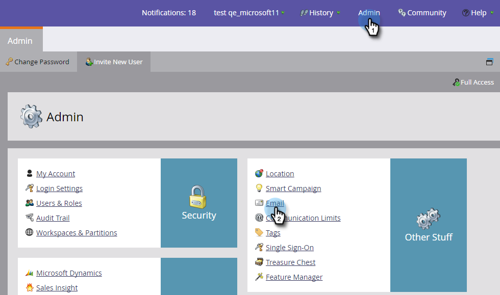

# Remova o texto de cancelamento de assinatura da seção &quot;Admin -> Email&quot; {#remove-unsubscribe-text-from-the-admin-email-section}

A única razão pela qual você deve remover completamente o conteúdo de cancelamento de inscrição da área &quot;Admin > Email&quot; é se estiver optando por criar o link de cancelamento de inscrição nos próprios modelos de email. A caixa de texto tem uma validação que não permite salvar sem nenhum conteúdo. Você pode contornar isso adicionando um pequeno comentário HTML. O comentário HTML não será exibido no cliente de email, pois ele está renderizando o email em HTML e os comentários são omitidos. Aqui está como fazer isso.

1. Vá para **Admin** e clique em **Email**.

   

1. Selecione todo o texto e pressione a tecla **Delete **key.

   >[!CAUTION]
   >
   >Antes de excluir, copie/cole em um documento de texto como backup.

1. Digite **<!--This is a comment -->**.

   

1. Clique em **Salvar alterações**.

   

>[!NOTE]
>
>Para **Cancelar inscrição de texto **é necessário adicionar um único caractere. Use um traço ou ponto final.

