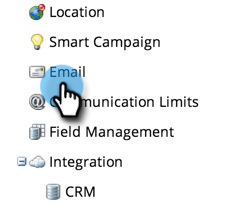

# Remova o texto de cancelamento de inscrição da seção Admin > Email {#remove-unsubscribe-text-from-the-admin-email-section}

A única razão pela qual você deve remover completamente o conteúdo de cancelamento de inscrição da **[!UICONTROL Admin]** > **[!UICONTROL E-mail]** é se você optar por criar o link de cancelamento de inscrição nos próprios modelos de email. A caixa de texto tem uma validação que não permite salvar sem conteúdo. Você pode contornar isso adicionando um pequeno comentário HTML. O comentário HTML não será exibido no cliente de email, pois está renderizando o email no HTML e os comentários são omitidos. Veja como fazer isso.

1. Vá para a **[!UICONTROL Admin]** área.

   

1. Clique em **[!UICONTROL E-mail]**.

   

1. Selecione todo o texto e pressione a tecla **[!UICONTROL Excluir]** chave.

   >[!CAUTION]
   >
   >Antes de excluir, copie/cole em um documento de texto como backup.

1. Digitar `<!--This is a comment -->`.

   

1. Clique em **[!UICONTROL Salvar alterações]**.

   

>[!NOTE]
>
>Para o **Cancelar inscrição do texto** você precisa adicionar um caractere único. Use um traço ou ponto.
