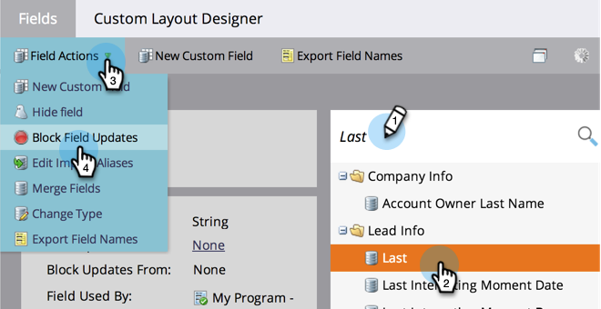
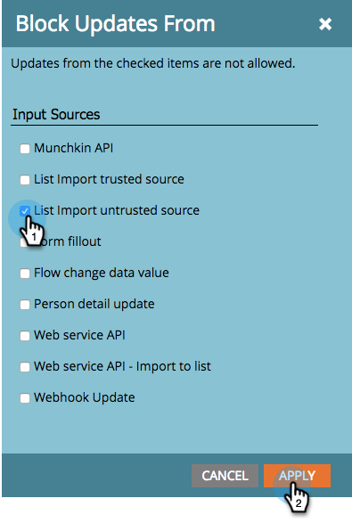
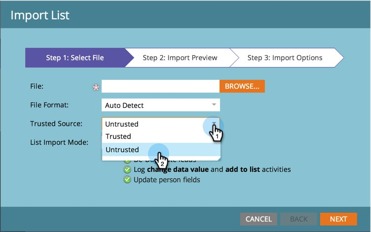

# Bloquear Atualizações de Campo Durante a Importação de Lista de Fontes Não Confiáveis {#block-field-updates-during-list-import-from-untrusted-sources}

Você pode confiar nos dados em algumas listas mais do que em outras. Às vezes, você pode ter dados questionáveis e desejar utilizá-los se o campo estiver em branco, mas não se houver um valor existente. Você pode fazer isso bloqueando atualizações de campo em campos principais.

>[!NOTE]
>
>**Permissões de administrador necessárias**

## Bloqueio de atualizações de campo a partir de fontes não confiáveis {#blocking-field-updates-from-untrusted-sources}

1. Vá para o **Administrador** área.

   

1. Clique em **Gerenciamento de campos**.

   

1. Encontre o campo desejado, selecione-o e, em seguida, em **Ações do campo**, clique em **Bloquear Atualizações de Campo**.

   

1. Verificar **Importar Lista de Origem Não Confiável** e clique em **Aplicar**.

   

>[!TIP]
>
>Você pode manter os campos seguros de todas as listas, confiáveis e não confiáveis, verificando também **Origem confiável de Importação de Lista**.

Repita as etapas acima para qualquer outro campo que desejar manter seguro de listas não confiáveis.

## Executando uma Importação de Lista Não Confiável {#running-an-untrusted-list-import}

1. Ao executar a importação da lista, selecione **Não confiável** se quiser que todos os campos configurados na etapa anterior sejam seguros.

   

Para obter instruções detalhadas sobre importação de listas, consulte [Importar uma lista de pessoas](/help/marketo/getting-started/quick-wins/import-a-list-of-people.md).

Bom trabalho! Agora você sabe como manter os campos principais seguros de listas não confiáveis.
