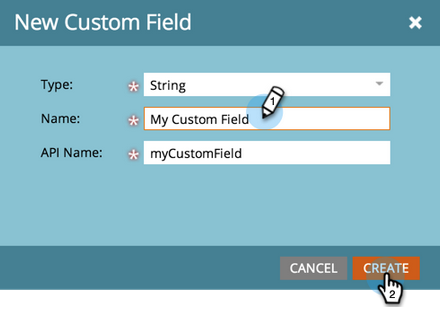

# Criar um campo personalizado no Marketo {#create-a-custom-field-in-marketo}

Saiba como criar um campo personalizado no Marketo Engage para armazenar e capturar dados.

1. Vá para a área **[!UICONTROL Administrador]**.

   

1. Clique em **[!UICONTROL Gerenciamento de campos]**.

   

   >[!TIP]
   >
   >Se quiser que os campos sejam mantidos em sincronia com o CRM, crie-os no CRM e eles serão criados automaticamente no Marketo.

1. Clique em **[!UICONTROL Novo Campo Personalizado]**.

   

1. Escolha o _[!UICONTROL Objeto]_.

   

   >[!NOTE]
   >
   >Embora você não possa selecionar o objeto _Empresa_ sozinho, é possível solicitá-lo entrando em contato com o [Suporte da Marketo](https://nation.marketo.com/t5/support/ct-p/Support){target="_blank"}.

1. Escolha o campo _[!UICONTROL Tipo]_. Isso mudará como ele é renderizado em Smart Lists e formulários no Marketo.

   >[!TIP]
   >
   >Confira o [Glossário de Tipos de Campos Personalizados](/help/marketo/product-docs/administration/field-management/custom-field-type-glossary.md){target="_blank"}.

   

1. Insira o _[!UICONTROL Nome]_ como deseja que apareça na Marketo (o _[!UICONTROL Nome da API]_ é gerado automaticamente). Escolha com cuidado, pois não é possível renomeá-lo após salvar. Clique em **[!UICONTROL Criar]** quando terminar.

>[!CAUTION]
>
>Nomes de campos não podem começar com os seguintes caracteres: **. &amp; +[]**

>[!NOTE]
>
>O nome da API é usado pela API do SOAP e outros processos de back-end.

Agora você pode usar esse campo personalizado em formulários, etapas de fluxo e Smart Lists.
