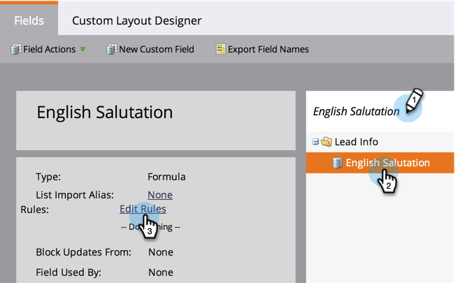

# Criar e usar um campo de string concatenada (fórmula) {#create-and-use-a-concatenated-string-formula-field}

É possível combinar valores de vários campos ou criar um valor condicional usando um campo Fórmula de marketing.

1. Vá para **Admin** e clique em **Gerenciamento de campo**.

   

1. Clique em **Novo campo personalizado**.

   

1. Selecione **Fórmula** para **Tipo**.

   

1. Digite um **Nome** para seu campo e clique em **Criar**.

   

1. Localize e selecione o campo de fórmula e clique em **Editar regras**.

   

1. Adicione duas opções e defina-as como a captura de tela abaixo.

   

   Saiba mais sobre [tokens para etapas de fluxo](../../../product-docs/core-marketo-concepts/smart-campaigns/flow-actions/use-tokens-in-flow-steps.md).

1. Agora você pode adicionar o campo de fórmula como um token em um email.

   

Bom trabalho! Agora você tem um campo inteligente que sabe qual saudação incluir baseado no gênero. Divirta-se com isso e se torne criativo.

>[!NOTE]
>
>Campos de fórmula podem ser usados em landings page, emails e colunas de lista inteligente; não são exportados. Emails com campos de fórmula não podem ser enviados por campanhas em lote

