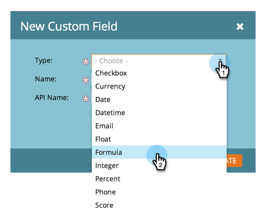

# Criar e usar um campo de string concatenada (fórmula) {#create-and-use-a-concatenated-string-formula-field}

Você pode combinar valores de vários campos ou criar um valor condicional usando um campo de fórmula Marketo Engage.

1. Vá para a **[!UICONTROL Admin]** área.

   

1. Clique em **[!UICONTROL Gerenciamento de campo]**.

   

1. Clique em **[!UICONTROL Novo campo personalizado]**.

   

1. Selecionar **[!UICONTROL Fórmula]** para o **[!UICONTROL Tipo]**.

   

1. Insira um **[!UICONTROL Nome]** para o campo e clique em **[!UICONTROL Criar]**.

   

1. Localize e selecione o campo de fórmula e clique em **[!UICONTROL Editar regras]**.

   

1. Adicione duas opções e as defina como a captura de tela abaixo.

   

   >[!TIP]
   >
   >Saiba mais sobre [tokens para etapas de fluxo](/help/marketo/product-docs/core-marketo-concepts/smart-campaigns/flow-actions/use-tokens-in-flow-steps.md).

1. Agora é possível adicionar o campo da fórmula como um token em um email.

   

>[!NOTE]
>
>Os campos de fórmula podem ser usados em Landing Pages, emails e colunas de Smart List. Os emails com campos de fórmula podem _não_ ser enviado usando uma campanha em lote. Use um [token de script de email](/help/marketo/product-docs/email-marketing/general/using-tokens/create-an-email-script-token.md) neste cenário.

Bom trabalho! Agora você tem um campo inteligente que sabe que saudação incluir com base no gênero. Divirta-se com isso e seja criativo.
