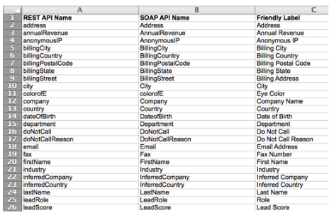

# Exportar uma lista de todos os nomes de campos da API do Marketo {#export-a-list-of-all-marketo-api-field-names}

Se estiver usando o [!DNL SOAP API] ou o [!DNL Munchkin API], você precisará de uma lista de todos os seus campos e seus Nomes de API.

>[!NOTE]
>
>**Permissões de administrador são necessárias**

1. Vá para a área **[!UICONTROL Administrador]**.

   

1. Clique em **[!UICONTROL Gerenciamento de campos]**.

   

1. Clique em **[!UICONTROL Exportar nomes de campo]** para baixar a planilha.

   

Agora você tem uma planilha com uma lista de todos os campos e seus Nomes de API.

>[!NOTE]
>
>O limite de caracteres para Nomes de API do MLM é de 255.
